.. _tut_mtext:

Tutorial for MText and MTextEditor
==================================

The :class:`~ezdxf.entities.MText` entity is a multi line entity with extended
formatting possibilities and requires at least DXF version R2000, to use all
features (e.g. background fill) DXF R2007 is required.

Prolog code:

.. code-block:: python

    import ezdxf

    doc = ezdxf.new("R2007", setup=True)
    msp = doc.modelspace()

    lorem_ipsum = """
    Lorem ipsum dolor sit amet, consectetur adipiscing elit,
    sed do eiusmod tempor incididunt ut labore et dolore magna
    aliqua. Ut enim ad minim veniam, quis nostrud exercitation
    ullamco laboris nisi ut aliquip ex ea commodo consequat.
    Duis aute irure dolor in reprehenderit in voluptate velit
    esse cillum dolore eu fugiat nulla pariatur. Excepteur sint
    occaecat cupidatat non proident, sunt in culpa qui officia
    deserunt mollit anim id est laborum.
    """

Adding a MText entity
---------------------

The MText entity can be added to any layout (modelspace, paperspace or block)
by the :meth:`~ezdxf.layouts.BaseLayout.add_mtext` function.

.. code-block:: python

    # store MText entity for additional manipulations
    mtext = msp.add_mtext(lorem_ipsum, dxfattribs={"style": "OpenSans"})

This adds a MText entity with text style "OpenSans".
The MText content can be accessed by the :attr:`text` attribute, this attribute
can be edited like any Python string:

.. code-block:: python

    mtext.text += "Append additional text to the MText entity."
    # even shorter with __iadd__() support:
    mtext += "Append additional text to the MText entity."

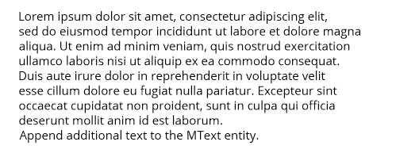

.. important::

    Line endings "\\n" will be replaced by the MTEXT line endings "\\P" at
    DXF export, but **not** vice versa "\\P" by "\\n" at DXF file loading.

Text placement
--------------

The location of the MText entity is defined by the :attr:`MText.dxf.insert` and
the :attr:`MText.dxf.attachment_point` attributes. The :attr:`attachment_point`
defines the text alignment relative to the :attr:`insert` location, default
value is 1.

Attachment point constants defined in :mod:`ezdxf.lldxf.const`:

============================== =======
MText.dxf.attachment_point     Value
============================== =======
MTEXT_TOP_LEFT                 1
MTEXT_TOP_CENTER               2
MTEXT_TOP_RIGHT                3
MTEXT_MIDDLE_LEFT              4
MTEXT_MIDDLE_CENTER            5
MTEXT_MIDDLE_RIGHT             6
MTEXT_BOTTOM_LEFT              7
MTEXT_BOTTOM_CENTER            8
MTEXT_BOTTOM_RIGHT             9
============================== =======

The MText entity has a method for setting :attr:`insert`,
:attr:`attachment_point` and :attr:`rotation` attributes
by one call: :meth:`~ezdxf.entities.MText.set_location`

Character height
----------------

The character height is defined by the DXF attribute
:attr:`MText.dxf.char_height` in drawing units, which
has also consequences for the line spacing of the MText entity:

.. code-block:: python

    mtext.dxf.char_height = 0.5

The character height can be changed inline, see also :ref:`mtext_formatting`
and :ref:`mtext_inline_codes`.

Text rotation (direction)
-------------------------

The :attr:`MText.dxf.rotation` attribute defines the text rotation as angle
between the x-axis and the horizontal direction of the text in degrees.
The :attr:`MText.dxf.text_direction` attribute defines the horizontal direction
of MText as vector in WCS or OCS, if an :ref:`OCS` is defined.
Both attributes can be present at the same entity, in this case the
:attr:`MText.dxf.text_direction` attribute has the higher priority.

The MText entity has two methods to get/set rotation:
:meth:`~ezdxf.entities.MText.get_rotation` returns the rotation angle in degrees
independent from definition as angle or direction, and
:meth:`~ezdxf.entities.MText.set_rotation` set the :attr:`rotation` attribute
and removes the :attr:`text_direction` attribute if present.

Defining a wrapping border
--------------------------

The wrapping border limits the text width and forces a line break for text
beyond this border. Without attribute :attr:`dxf.width` (or setting 0) the
lines are wrapped only at the regular line endings " \\P" or "\\n", setting the
reference column width forces additional line wrappings at the given width.
The text height can not be limited, the text always occupies as much space as
needed.

.. code-block:: python

    mtext.dxf.width = 60

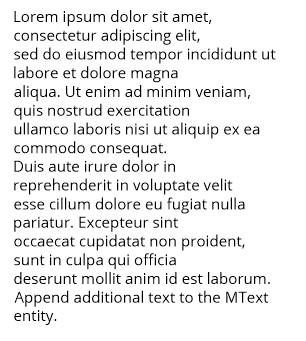

.. _mtext_formatting:

MText formatting
----------------

MText supports inline formatting by special codes: :ref:`mtext_inline_codes`

.. code-block:: python

    mtext.text = "{\\C1;red text} - {\\C3;green text} - {\\C5;blue text}"

See also new section for the new support class `MTextEditor`_ in `ezdxf` v0.17.

Stacked text
------------

MText also supports stacked text:

.. code-block:: python

    # the space ' ' in front of 'Lower' and the ';' behind 'Lower' are necessary
    # combined with vertical center alignment
    mtext.text = "\\A1;\\SUpper^ Lower; - \\SUpper/ Lower;} - \\SUpper# Lower;"

See also new section for the new support class `MTextEditor`_ in `ezdxf` v0.17.

Background color (filling)
--------------------------

The MText entity can have a background filling:

- :ref:`ACI`
- true color value as ``(r, g, b)`` tuple
- color name as string, use special name ``'canvas'`` to use the canvas
  background color

Because of the complex dependencies `ezdxf` provides a method to set all
required DXF attributes at once:

.. code-block:: python

    mtext.set_bg_color(2, scale=1.5)

The parameter `scale` determines how much border there is around the text, the
value is based on the text height, and should be in the range of 1 - 5,
where 1 fits exact the MText entity.

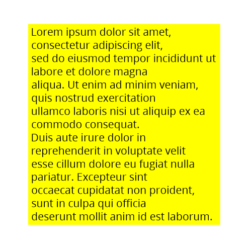

.. _mtext_editor_tut:

MTextEditor
-----------

.. versionadded:: 0.17

.. warning::

    The :class:`MTextEditor` assembles just the inline code, which has to be
    parsed and rendered by the target CAD application, `ezdxf` has no influence
    to that result.

    Keep inline formatting as simple as possible, don't test the limits of its
    capabilities, this will not work across different CAD applications and keep
    the formatting in a logic manner like, do not change paragraph properties
    in the middle of a paragraph.

    **There is no official documentation for the inline codes!**

The :class:`~ezdxf.tools.text.MTextEditor` class provides a floating interface
to build :class:`MText` content in an easy way.

This example only shows the connection between :class:`MText` and the
:class:`MTextEditor`, and shows no additional features to the first example of
this tutorial:

Init Editor
+++++++++++

.. code-block:: python

    import ezdxf
    from ezdxf.tools.text import MTextEditor

    doc = ezdxf.new("R2007", setup=True)
    msp = doc.modelspace()

    lorem_ipsum = """
    Lorem ipsum dolor sit amet, consectetur adipiscing elit, ... see prolog code
    """

    # create a new editor object with an initial text:
    editor = MTextEditor(lorem_ipsum)

    # get the MTEXT content string from the editor by the str() function:
    mtext = msp.add_mtext(str(editor), dxfattribs={"style": "OpenSans"})

Tutorial Prolog:

.. code-block:: python

    # use constants defined in MTextEditor:
    NP = MTextEditor.NEW_PARAGRAPH

    ATTRIBS = {
        "char_height": 0.7,
        "style": "OpenSans",
        "width": 10,
    }
    editor = MTextEditor("using colors:" + NP)

Set Text Color
++++++++++++++

There are three ways to change the color inline:

- by color name "red", "green", "blue", "yellow", "cyan", "magenta", "white"
- by :ref:`ACI`
- by RGB values

.. code-block:: python

    # RED: set color by name - red, green, blue, yellow, cyan, magenta, white
    editor.color("red").append("RED" + NP)
    # RED: the color stays the same until the next change
    editor.append("also RED" + NP)

    # GREEN: change color by ACI (AutoCAD Color Index)
    editor.aci(3).append("GREEN" + NP)

    # BLUE: change color by RGB tuples
    editor.rgb((0, 0, 255)).append("BLUE" + NP)

    # add the MTEXT entity to the model space:
    msp.add_mtext(str(editor), attribs)

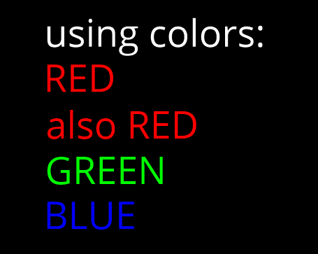

Changing Text Height
++++++++++++++++++++

The :meth:`MtextEditor.height` method set the text height as absolute value in
drawing units (text height = cap height):

.. code-block:: Python

    attribs = dict(ATTRIBS)
    attribs["width"] = 40.0
    editor = MTextEditor("changing text height absolute: default height is 0.7" + NP)
    # doubling the default height = 1.4
    editor.height(1.4)
    editor.append("text height: 1.4" + NP)
    editor.height(3.5).append("text height: 3.5" + NP)
    editor.height(0.7).append("back to default height: 0.7" + NP)
    msp.add_mtext(str(editor), attribs)

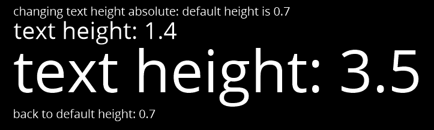

The :meth:`MtextEditor.scale_height` method set the text height by a relative
factor, the :class:`MtextEditor` object does not keep track of current text
height, you have to do this by yourself. The initial text height is
:attr:`MText.dxf.char_height`:

.. code-block:: Python

    attribs = dict(ATTRIBS)
    attribs["width"] = 40.0
    editor = MTextEditor("changing text height relative: default height is 0.7" + NP)
    # this is the default text height in the beginning:
    current_height = attribs["char_height"]
    # The text height can only be changed by a factor:
    editor.scale_height(2)  # scale by 2 = 1.4
    # keep track of the actual height:
    current_height *= 2
    editor.append("text height: 1.4" + NP)
    # to set an absolute height, calculate the required factor:
    desired_height = 3.5
    factor = desired_height / current_height
    editor.scale_height(factor).append("text height: 3.5" + NP)
    current_height = desired_height
    # and back to 0.7
    editor.scale_height(0.7 / current_height).append("back to default height: 0.7" + NP)
    msp.add_mtext(str(editor), attribs).set_location(insert=location)

Changing Font
+++++++++++++

The font name for changing :class:`MText` fonts inline is the font family name!
The font family name is the name shown in font selection widgets in
desktop applications: "Arial", "Times New Roman", "Comic Sans MS".
The font has to be installed at the target system, else then CAD default
font will be used, in AutoCAD/BricsCAD is this the font defined for the text
style "Standard".

.. important::

    The DXF/DWG format is not optimal for preserving text layouts across
    multiple systems, and it's getting really bad across different CAD
    applications.

.. code-block:: Python

    attribs = dict(ATTRIBS)
    attribs["width"] = 15.0
    editor = MTextEditor("changing fonts:" + NP)
    editor.append("Default: Hello World!" + NP)
    editor.append("SimSun: ")
    # change font in a group to revert back to the default font at the end:
    simsun_editor = MTextEditor().font("SimSun").append("你好，世界" + NP)
    # reverts the font back at the end of the group:
    editor.group(str(simsun_editor))
    # back to default font OpenSans:
    editor.append("Times New Roman: ")
    # change font outside of a group until next font change:
    editor.font("Times New Roman").append("Привет мир!" + NP)
    # If the font does not exist, a replacement font will be used:
    editor.font("Does not exist").append("This is the replacement font!")
    msp.add_mtext(str(editor), attribs)

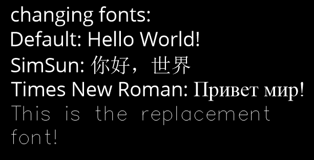

Set Paragraph Properties
++++++++++++++++++++++++

The paragraph properties are set by the :meth:`~ezdxf.tools.text.MTextEditor.paragraph`
method and a :class:`~ezdxf.tools.text.ParagraphProperties` object, which bundles
all paragraph properties in a named tuple.

Each paragraph can have its own properties for:

- indentation arguments:

    - ``indent`` is the left indentation of the first line
    - ``left``  is the left side indentation of the paragraph
    - ``right`` is the right side indentation of the paragraph

- text adjustment: ``align``, by enum :class:`MTextParagraphAlignment`

    - MTextParagraphAlignment.LEFT
    - MTextParagraphAlignment.RIGHT
    - MTextParagraphAlignment.CENTER
    - MTextParagraphAlignment.JUSTIFIED
    - MTextParagraphAlignment.DISTRIBUTED

- tabulator stops: ``tab_stops``, a tuple of tabulator stops

Indentation and tabulator stops are multiples of the default :class:`MText`
text height stored in :class:`MText.dxf.char_height`. Calculate the drawing
units for indentation and tabulator stops, by multiplying the indentation
value by the :attr:`char_height` value.

:class:`Mtext` paragraphs are separated by new paragraph "\\P" characters.

.. code-block:: Python

    # import support classes:
    from ezdxf.tools.text import ParagraphProperties, MTextParagraphAlignment

    attribs = dict(ATTRIBS)
    attribs["char_height"] = 0.25
    attribs["width"] = 7.5
    editor = MTextEditor("Indent the first line:" + NP)
    props = ParagraphProperties(
        indent=1,  # indent first line = 1x0.25 drawing units
        align=MTextParagraphAlignment.JUSTIFIED
    )
    editor.paragraph(props)
    editor.append(lorem_ipsum)
    msp.add_mtext(str(editor), attribs)

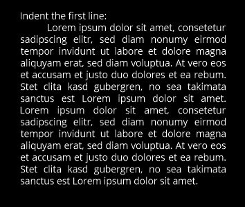

The first line indentation "indent" is relative to the "left" indentation.

.. code-block:: Python

    # import support classes:
    from ezdxf.tools.text import ParagraphProperties, MTextParagraphAlignment

    attribs = dict(ATTRIBS)
    attribs["char_height"] = 0.25
    attribs["width"] = 7.5
    editor = MTextEditor("Indent left paragraph side:" + NP)
    indent = 0.7  # 0.7 * 0.25 = 0.175 drawing units
    props = ParagraphProperties(
        # first line indentation is relative to "left", this reverses the
        # left indentation:
        indent=-indent,  # first line
        # indent left paragraph side:
        left=indent,
        align=MTextParagraphAlignment.JUSTIFIED
    )
    editor.paragraph(props)
    editor.append(" ".join(lorem_ipsum(100)))
    msp.add_mtext(str(editor), attribs).set_location(insert=location)

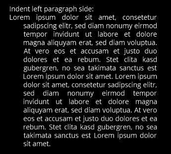

Bullet List
+++++++++++

There are no special commands to build bullet list, the list is build of
indentation and a tabulator stop. Each list item needs a marker as an
arbitrary string. For more information about paragraph indentation and
tabulator stops see also chapter `Set Paragraph Properties`_.

.. code-block:: Python

    attribs = dict(ATTRIBS)
    attribs["char_height"] = 0.25
    attribs["width"] = 7.5
    bullet = "•"  # alt + numpad 7
    editor = MTextEditor("Bullet List:" + NP)
    editor.bullet_list(
        indent=1,
        bullets=[bullet] * 3,  # each list item needs a marker
        content=[
            "First item",
            "Second item",
            " ".join(lorem_ipsum(30)),
        ])
    msp.add_mtext(str(editor), attribs)

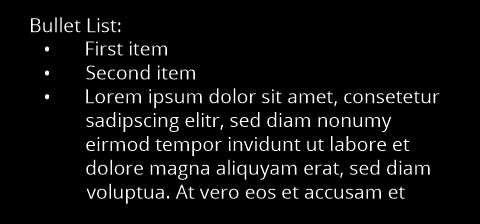

Numbered List
+++++++++++++

There are no special commands to build numbered list, the list is build of
indentation and a tabulator stop. There is no automatic numbering,
but therefore the absolute freedom for using any string as list marker.
For more information about paragraph indentation and
tabulator stops see also chapter `Set Paragraph Properties`_.

.. code-block:: Python

    attribs = dict(ATTRIBS)
    attribs["char_height"] = 0.25
    attribs["width"] = 7.5
    editor = MTextEditor("Numbered List:" + NP)
    editor.bullet_list(
        indent=1,
        bullets=["1.", "2.", "3."],
        content=[
            "First item",
            "Second item",
            " ".join(lorem_ipsum(30)),
        ])
    msp.add_mtext(str(editor), attribs)

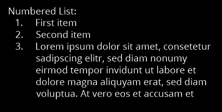

Stacked Text
++++++++++++

:class:`MText` supports stacked text (fractions) as a single inline code, which
means it is not possible to change any property inside the fraction.
This example shows a fraction with scaled down text height, placed in a group
to revert the text height afterwards:

.. code-block:: Python

    editor = MTextEditor("Stacked text:" + NP)

    stack = MTextEditor().scale_height(0.6).stack("1", "2", "^")
    editor.append("over: ").group(str(stack)).append(NP)

    stack = MTextEditor().scale_height(0.6).stack("1", "2", "/")
    editor.append("fraction: ").group(str(stack)).append(NP)

    stack = MTextEditor().scale_height(0.6).stack("1", "2", "#")
    editor.append("slanted: ").group(str(stack)).append(NP)

    # Additional formatting in numerator and denominator is not supported
    # by AutoCAD or BricsCAD, switching the color inside the stacked text
    # to red does not work:
    numerator = MTextEditor().color("red").append("1")
    stack = MTextEditor().scale_height(0.6).stack(str(numerator), "2", "#")
    editor.append("color red: ").group(str(stack)).append(NP)

    msp.add_mtext(str(editor), attribs)

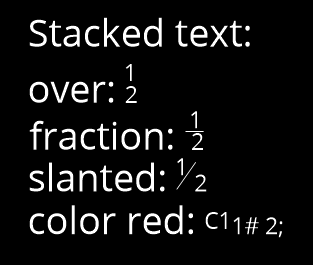

.. seealso::

    - :class:`~ezdxf.tools.text.MTextEditor` example code on `github`_.
    - Documentation of :class:`~ezdxf.tools.text.MTextEditor`

.. _github: https://github.com/mozman/ezdxf/blob/master/examples/entities/mtext_editor.py