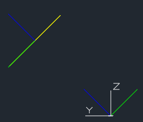
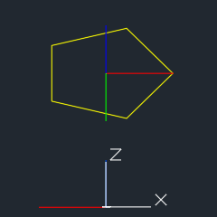
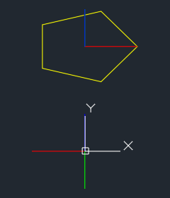

.. _tut_coordinates:

.. _tut_ocs:

Tutorial for OCS Usage
======================

First you need an understanding of vectors, if you don't have it, watch the YouTube tutorials of `3Blue1Brown`_ about
`Linear Algebra`_.

Second read the :ref:`Coordinate Systems` introduction please.

For :ref:`WCS` there is not much to say as, it is what it is: the main world coordinate system, and an a drawing unit can
have any real world unit you want. Autodesk added some mechanism to define a scale for dimension and text entities, but
because I am not an AutoCAD user, I am not familiar with it, and further more I think this is more an AutoCAD topic than
a DXF topic.

Object Coordinate System (OCS)
------------------------------

The :ref:`OCS` is used to place planar 2D entities in 3D space. **ALL** points of a planar entity lay in the same plane,
this is also true if the plane is located in 3D space by an OCS. There are three basic DXF attributes that gives a 2D
entity its spatial form.

Extrusion
~~~~~~~~~

The extrusion vector defines the OCS, it is a normal vector to the base plane of a planar entity. This `base plane` is
always located in the origin of the :ref:`WCS`. But there are some entities like :class:`Ellipse`, which have an
extrusion vector, but do not establish an OCS. For this entities the extrusion vector defines only the extrusion
direction and thickness defines the extrusion distance, but all other points in WCS.

Elevation
~~~~~~~~~

The elevation value defines the z-axis value for all points of a planar entity, this is an OCS value, and defines
the distance of the entity plane from the `base plane`.

This value exists only in output from DXF versions prior to R11 as separated DXF attribute (group code 38).
In DXF version R12 and later, the elevation value is supplied as z-axis value of each point. But as always in DXF, this
simple rule does not apply to all entities: :class:`LWPolyline` has an elevation attribute, :class:`Hatch` has an
elevation point (z=elevation , x=y=0), and so on.

Thickness
~~~~~~~~~

Defines the extrusion distance for an entity.

Placing 2D Circle in 3D Space
-----------------------------

The colors for axis follow the AutoCAD standard:

    - red is x-axis
    - green is y-axis
    - blue is z-axis

.. literalinclude:: ../../../examples/tut/ocs/circle.py
    :start-after: # include-start
    :end-before: # include-end

The following image shows the 2D circle in 3D space in AutoCAD `Left` and `Front` view. The blue line shows the OCS z-axis
(extrusion direction), elevation is the distance from the origin to the center of the circle in this case `2.828`,
and you see that the x- and y- axis of OCS and WCS are not aligned.

.. image:: gfx/ocs-circle-side-view.png
    :alt: circle in ocs as side view
.. image:: gfx/ocs-circle-front-view.png
    :alt: circle in ocs as front view

Placing LWPolyline in 3D Space
------------------------------

.. literalinclude:: ../../../examples/tut/ocs/lwpolyline.py
    :start-after: # include-start
    :end-before: # include-end

The following image shows the 2D pentagon in 3D space in AutoCAD `Left`, `Front` and `Top` view. The three lines from the
center of the pentagon show the UCS, the three colored lines in the origin show the OCS the white lines in the origin
show the WCS.

The z-axis of the UCS and the OCS show the same direction (extrusion direction), and the x-axis of the UCS and the WCS
show the same direction. The elevation is the distance from the origin to the center of the pentagon and all points of
the pentagon have the same elevation, and you see that the y- axis of UCS, OCS and WCS are not aligned.

.. _Linear Algebra: https://www.youtube.com/watch?v=kjBOesZCoqc&list=PLZHQObOWTQDPD3MizzM2xVFitgF8hE_ab
.. _3Blue1Brown: https://www.youtube.com/channel/UCYO_jab_esuFRV4b17AJtAw

