.. module:: ezdxf.math
    :noindex:

.. _tut_coordinates:

.. _tut_ocs:

Tutorial for OCS/UCS Usage
==========================

For OCS/UCS usage is a basic understanding of vectors required, for a brush up,
watch the YouTube tutorials of `3Blue1Brown`_ about `Linear Algebra`_.

Second read the :ref:`Coordinate Systems` introduction please.

.. seealso::

    The free online book `3D Math Primer for Graphics and Game Development <https://gamemath.com/>`_
    is a very good resource for learning vector math and other graphic related topics,
    it is easy to read for beginners and especially targeted to programmers.

For :ref:`WCS` there is not much to say as, it is what it is: the main world coordinate system, and a drawing unit can
have any real world unit you want. Autodesk added some mechanism to define a scale for dimension and text entities, but
because I am not an AutoCAD user, I am not familiar with it, and further more I think this is more an AutoCAD topic than
a DXF topic.

Object Coordinate System (OCS)
------------------------------

The :ref:`OCS` is used to place planar 2D entities in 3D space. **ALL** points of a planar entity lay in the same plane,
this is also true if the plane is located in 3D space by an OCS. There are three basic DXF attributes that gives a 2D
entity its spatial form.

Extrusion
~~~~~~~~~

The extrusion vector defines the OCS, it is a normal vector to the base plane of a planar entity. This `base plane` is
always located in the origin of the :ref:`WCS`. But there are some entities like :class:`~ezdxf.entities.Ellipse`,
which have an extrusion vector, but do not establish an OCS. For this entities the extrusion vector defines
only the extrusion direction and thickness defines the extrusion distance, but all other points in WCS.

Elevation
~~~~~~~~~

The elevation value defines the z-axis value for all points of a planar entity, this is an OCS value, and defines
the distance of the entity plane from the `base plane`.

This value exists only in output from DXF versions prior to R11 as separated DXF attribute (group code 38).
In DXF R12 and later, the elevation value is supplied as z-axis value of each point. But as always in DXF, this
simple rule does not apply to all entities: :class:`~ezdxf.entities.LWPolyline` and :class:`~ezdxf.entities.Hatch`
have an DXF attribute :attr:`elevation`, where the z-axis of this point is the elevation height and
the x-axis = y-axis = ``0``.

Thickness
~~~~~~~~~

Defines the extrusion distance for an entity.

.. note::

    There is a new edition of this tutorial using UCS based transformation, which are available in `ezdxf`
    v0.11 and later: :ref:`tut_ucs_transform`

    This edition shows the **hard way** to accomplish the transformations by low level operations.

Placing 2D Circle in 3D Space
-----------------------------

The colors for axis follow the AutoCAD standard:

    - red is x-axis
    - green is y-axis
    - blue is z-axis

.. literalinclude:: src/ocs/circle.py
    :lines: 6-29

The following image shows the 2D circle in 3D space in AutoCAD `Left` and `Front` view. The blue line shows the OCS z-axis
(extrusion direction), elevation is the distance from the origin to the center of the circle in this case 2.828,
and you see that the x- and y-axis of OCS and WCS are not aligned.

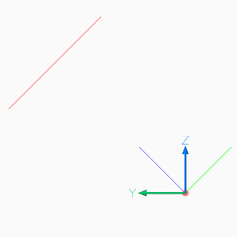
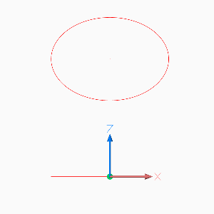

Placing LWPolyline in 3D Space
------------------------------

For simplicity of calculation I use the :class:`UCS` class in this example to place a 2D pentagon in 3D space.

.. literalinclude:: src/ocs/lwpolyline.py
    :lines: 12-37

The following image shows the 2D pentagon in 3D space in AutoCAD `Left`, `Front` and `Top` view. The three lines from the
center of the pentagon show the UCS, the three colored lines in the origin show the OCS the white lines in the origin
show the WCS.

The z-axis of the UCS and the OCS show the same direction (extrusion direction), and the x-axis of the UCS and the WCS
show the same direction. The elevation is the distance from the origin to the center of the pentagon and all points of
the pentagon have the same elevation, and you see that the y- axis of UCS, OCS and WCS are not aligned.

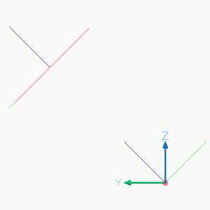
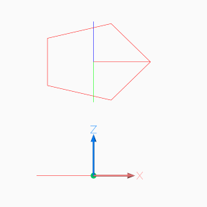

Using UCS to Place 3D Polyline
------------------------------

It is much simpler to use a 3D :class:`~ezdxf.entities.Polyline` to create the 3D pentagon.
The :class:`UCS` class is handy for this example and all kind of 3D operations.

.. literalinclude:: src/ocs/polyline3d.py
    :lines: 13-43

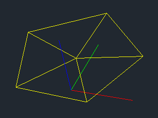

Placing 2D Text in 3D Space
---------------------------

The problem by placing text in 3D space is the text rotation, which is always counter clockwise around the OCS z-axis,
and ``0`` degree is in direction of the positive OCS x-axis, and the OCS x-axis is calculated by the
:ref:`Arbitrary Axis Algorithm`.

Calculate the OCS rotation angle by converting the TEXT rotation angle (in UCS or WCS) into a vector or begin with text
direction as vector, transform this direction vector into OCS and convert the OCS vector back into an angle in the OCS
xy-plane (see example), this procedure is available as :meth:`UCS.to_ocs_angle_deg` or :meth:`UCS.to_ocs_angle_rad`.

AutoCAD supports thickness for the TEXT entity only for `.shx` fonts and not for true type fonts.

.. literalinclude:: src/ocs/text.py
    :lines: 12-33

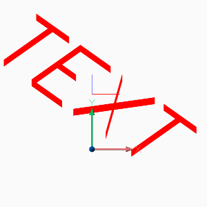

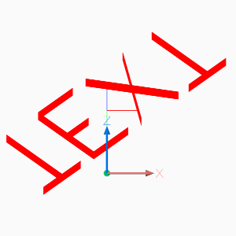

.. hint::

    For calculating OCS angles from an UCS, be aware that 2D entities, like TEXT or ARC, are placed parallel to the
    xy-plane of the UCS.

Placing 2D Arc in 3D Space
--------------------------

Here we have the same problem as for placing text, you need the start and end angle of the arc in degrees in OCS, and
this example also shows a shortcut for calculating the OCS angles.

.. literalinclude:: src/ocs/arc.py
    :lines: 12-32

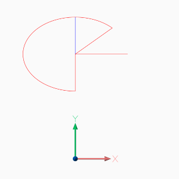
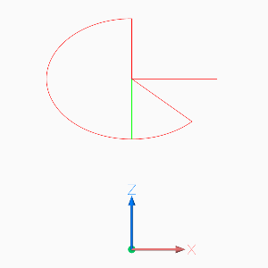

Placing Block References in 3D Space
------------------------------------

Despite the fact that block references (:class:`~ezdxf.entities.Insert`) can contain true 3D entities like
:class:`~ezdxf.entities.Line` or :class:`~ezdxf.entities.Mesh`, the :class:`~ezdxf.entities.Insert` entity
uses the same placing principe as :class:`~ezdxf.entities.Text` or :class:`~ezdxf.entities.Arc` shown in the
previous chapters.

Simple placing by OCS and rotation about the z-axis, can be achieved the same way as for generic 2D
entity types. The DXF attribute :attr:`Insert.dxf.rotation` rotates a block reference around the
block z-axis, which is located in the :attr:`Block.dxf.base_point`. To rotate the block reference
around the WCS x-axis, a transformation of the block z-axis into the WCS x-axis is required by
rotating the block z-axis 90 degree counter clockwise around y-axis by using an UCS:

This is just an excerpt of the important parts, see the whole code of `insert.py`_ at github.

.. literalinclude:: src/ocs/insert.py
    :lines: 47-69

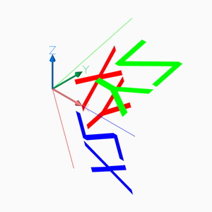
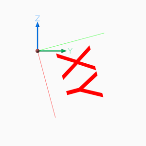

To rotate a block reference around another axis than the block z-axis, you have to find the rotated z-axis
(extrusion vector) of the rotated block reference, following example rotates the block reference around the
block x-axis by 15 degrees:

.. literalinclude:: src/ocs/insert.py
    :lines: 74-88

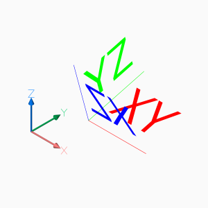
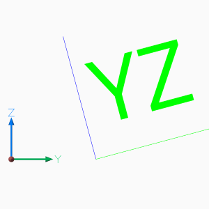

The next example shows how to translate a block references with an already established OCS:

.. literalinclude:: src/ocs/insert.py
    :lines: 90-99

Setting a new insert location is the same procedure without adding a translation vector, just transform the new
insert location into the OCS.

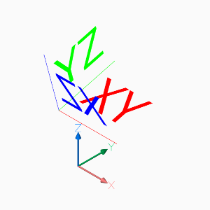
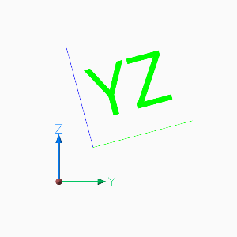

The next operation is to rotate a block reference with an established OCS, rotation axis is the block y-axis,
rotation angle is -90 degrees. First transform block y-axis (rotation axis) and block z-axis (extrusion vector)
from OCS into WCS:

.. literalinclude:: src/ocs/insert.py
    :lines: 101-106

Build transformation matrix and transform extrusion vector and build new UCS:

.. literalinclude:: src/ocs/insert.py
    :lines: 107-114

Set new OCS attributes, we also have to set the rotation attribute even though we do not rotate the block reference
around the local z-axis, the new block x-axis (0 deg) differs from OCS x-axis and has to be adjusted:

.. literalinclude:: src/ocs/insert.py
    :lines: 116-122

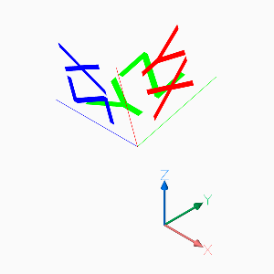
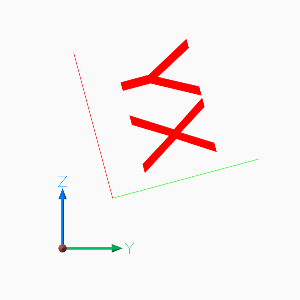

And here is the point, where my math knowledge ends, for more advanced CAD operation you have to look elsewhere.

.. _Linear Algebra: https://www.youtube.com/watch?v=kjBOesZCoqc&list=PLZHQObOWTQDPD3MizzM2xVFitgF8hE_ab
.. _3Blue1Brown: https://www.youtube.com/channel/UCYO_jab_esuFRV4b17AJtAw
.. _insert.py: https://github.com/mozman/ezdxf/blob/master/docs/source/tutorials/src/ocs/insert.py
