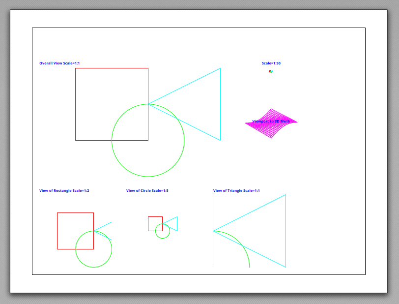

.. _tut_psp_viewports:

Tutorial for Viewports in Paperspace
====================================

This tutorial is based on the example script `viewports_in_paperspace.py`.
The script creates DXF files for the version R12 and for R2000+, but the
export for DXF R12 has a wrong papersize in BricsCAD and wrong margins in
Autodesk DWG Trueview. I don't know why this happens and I don't waste my time
to fix this.

.. important::

    If you need paperspace layouts use DXF version R2000 or newer because
    the export of the page dimensions does not work for DXF R12!

The scripts creates three flat geometries in the xy-plane of the :ref:`WCS` and a
3D mesh as content of the modelspace:

.. image:: gfx/vp-tut-msp-content.png
    :align: center

Page Setup
----------

The paperspace layout feature lacks documentation in the DXF reference,
there is no information in practice on **how** it is used, so most of
the information here is assumptions gathered through trail and error.

The :meth:`~ezdxf.layouts.Paperspace.page_setup` method defines the properties
of the paper sheet itself.  The units of the modelspace and the paperspace are
not related and can even have different unit systems (imperial, meters), but to
keep things simple it's recommended to use the same unit system for both spaces.

.. code-block:: Python

    layout.page_setup(size=(24, 18), margins=(1, 1, 1, 1), units="inch")

The `size` argument defines the overall paper size in rotation mode 0, it seems
to be the best practice to define the paper extents in landscape mode and rotate
the paper by the `rotate` argument afterwards.

Choices for the `rotation` argument:

    === ============
    0   no rotation
    1   90 degrees counter-clockwise
    2   upside-down
    3   90 degrees clockwise
    === ============

The `scale` argument reflects the relationship between paper unit and drawing
unit in paperspace. It's recommended to let this scale at the default value of
1:1 and draw lines and text in paperspace with the same units as you defined
the paper size.

.. seealso::

    - AutoCAD: `About Plotting`_ and `About Setting the Plot Scale`_
    - BricsCAD: `General Procedure for Printing`_

Drawing in Paperspace
---------------------

You can add DXF entities to the paperspace like to any other layout space.
The coordinate origin (0, 0) is in the left bottom corner of the canvas which
is the paper size minus the margins. You can draw beyond this limits but CAD
applications may not print that content.

.. hint::

    By writing this tutorial I noticed that changing the printer/plotter and the
    paper size does shift the layout content, because all paper sizes are defined
    without margins. Maybe it's preferable to set all margins to zero.

Adding Viewports
----------------

The :class:`~ezdxf.entities.Viewport` entity is a window to the modelspace to
display the content of the modelspace in paperspace with an arbitrary scaling
and rotation.
The VIEWPORT entity will be added by the factory method :meth:`~ezdxf.layouts.Paperspace.add_viewport`,
the `center` argument defines the center and the `size` argument defines the
width and height of the of the VIEWPORT in paperspace. The source of the
modelspace to display is defined by the arguments `view_center_point` and
`view_height`.

Scaling Factor
--------------

The scaling factor of the VIEWPORT is not an explicit value, the factor
is defined by the relation of the VIEWPORT height of the `size` argument and
the `view_height` argument.

If both values are equal the scaling is 1:1

.. code-block:: Python

    paperspace.add_viewport(
        center=(14.5, 2.5),
        size=(5, 5),
        view_center_point=(12.5, 7.5),
        view_height=5,
    )

If the `view_height` is 5x larger than the VIEWPORT height the scaling is 1:5

.. code-block:: Python

    paperspace.add_viewport(
        center=(8.5, 2.5),
        size=(5, 5),
        view_center_point=(10, 5),
        view_height=25,
    )

View Direction
--------------

The default view direction is the top down view, but can be changed to any view
by the attributes `view_target_point` and  `view_direction_vector` of the
:attr:`dxf` namespace.

.. code-block:: Python

    vp = paperspace.add_viewport(
        center=(16, 10), size=(4, 4), view_center_point=(0, 0), view_height=30
    )
    vp.dxf.view_target_point = (40, 40, 0)
    vp.dxf.view_direction_vector = (-1, -1, 1)

Viewport Frame
--------------

The VIEWPORT frame (borderlines) are shown in paperspace by default.
The VIEWPORT entity does not have an attribute to change this.
The visibility of the VIEWPORT frame is controlled by the layer assigned to the
VIEWPORT entity which is the layer "VIEWPORTS" by default in `ezdxf`.
Turning off this layer hides the frames of the VIEWPORT entities on this layer,
to do that the layer "VIEWPORTS" have to be created by the library user:

.. code-block:: Python

    vp_layer = doc.layers.add("VIEWPORTS")
    vp_layer.off()

.. _viewports_in_paperspace.py: https://github.com/mozman/ezdxf/blob/master/examples/viewports_in_paperspace.py
.. _About Plotting: https://help.autodesk.com/view/ACD/2018/ENU/?guid=GUID-2DB9EB8C-767C-4C91-B0A3-FFFEC4C5863A
.. _About Setting the Plot Scale: https://help.autodesk.com/view/ACD/2018/ENU/?guid=GUID-89604826-0B55-4994-8214-1CA93FA66985
.. _General Procedure for Printing: https://help.bricsys.com/document/_guides--BCAD_printing_and_plotting--GD_generalprocedureforprinting/V23/EN_US?id=165079156041