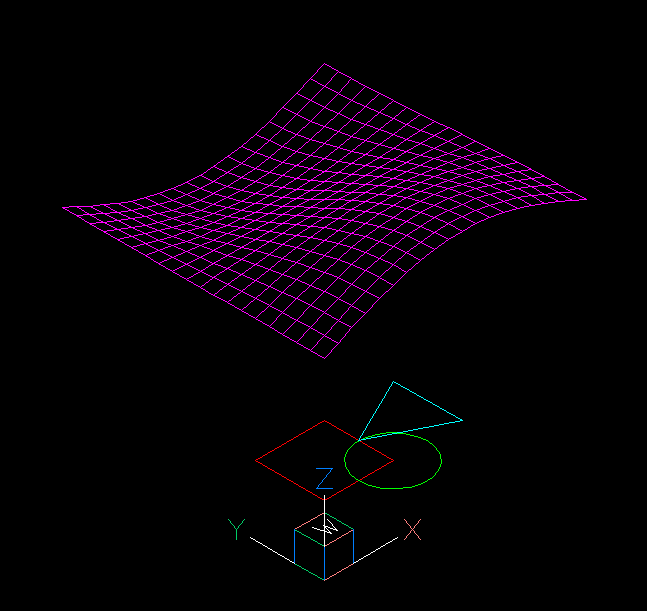

.. _tut_psp_viewports:

Tutorial for Viewports in Paperspace
====================================

This tutorial is based on the example script `viewports_in_paperspace.py`.
The script creates DXF files for the version R12 and for R2000+, but the
export for DXF R12 has a wrong papersize in BricsCAD and wrong margins in
Autodesk DWG Trueview. I don't know why this happens and I don't waste my time
to fix this.

.. important::

    If you need paperspace layouts use DXF version R2000 or newer because
    the export of the page dimensions does not work for DXF R12!

The scripts creates three flat geometries in the xy-plane of the :ref:`WCS` and a
3D mesh as content of the modelspace:

Page Setup
----------

The paperspace layout feature lacks documentation in the DXF reference,
there is no information in practice on **how** it is used, so most of
the information here is assumptions gathered through trail and error.

The :meth:`~ezdxf.layouts.Paperspace.page_setup` method defines the properties
of the paper sheet itself.  The units of the modelspace and the paperspace are
not related and can even have different unit systems (imperial, meters), but to
keep things simple it's recommended to use the same unit system for both spaces.

.. code-block:: Python

    layout.page_setup(size=(22, 17), margins=(1, 1, 1, 1), units="inch")

The `size` argument defines the overall paper size in rotation mode 0, it seems
to be the best practice to define the paper extents in landscape mode and rotate
the paper by the `rotate` argument afterwards.

Choices for the `rotation` argument:

    === ============
    0   no rotation
    1   90 degrees counter-clockwise
    2   upside-down
    3   90 degrees clockwise
    === ============

The `scale` argument reflects the relationship between paper unit and drawing
unit in paperspace. It's recommended to let this scale at the default value of
1:1 and draw lines and text in paperspace with the same units as you defined
the paper size.

.. seealso::

    - AutoCAD: `About Plotting`_ and `About Setting the Plot Scale`_
    - BricsCAD: `General Procedure for Printing`_

Viewport Setup
--------------

.. _viewports_in_paperspace.py: https://github.com/mozman/ezdxf/blob/master/examples/viewports_in_paperspace.py
.. _About Plotting: https://help.autodesk.com/view/ACD/2018/ENU/?guid=GUID-2DB9EB8C-767C-4C91-B0A3-FFFEC4C5863A
.. _About Setting the Plot Scale: https://help.autodesk.com/view/ACD/2018/ENU/?guid=GUID-89604826-0B55-4994-8214-1CA93FA66985
.. _General Procedure for Printing: https://help.bricsys.com/document/_guides--BCAD_printing_and_plotting--GD_generalprocedureforprinting/V23/EN_US?id=165079156041