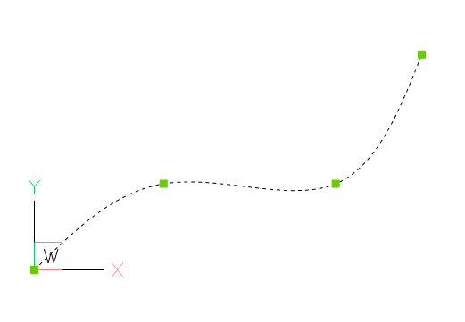
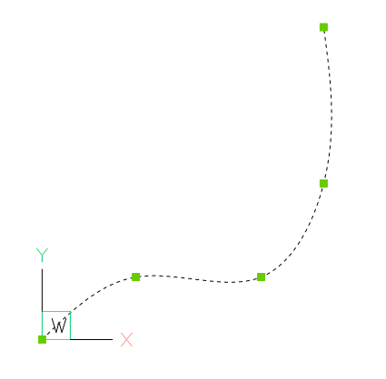

.. _tut_spline:

Tutorial for Spline
===================

Background information about `B-spline`_ at Wikipedia.

Splines from fit points
-----------------------

Splines can be defined by fit points only, this means the curve goes through all given fit points.
AutoCAD and BricsCAD generates required control points and knot values by itself, if only fit points
are present.

Create a simple spline:

.. code-block:: python

    doc = ezdxf.new('R2000')

    fit_points = [(0, 0, 0), (750, 500, 0), (1750, 500, 0), (2250, 1250, 0)]
    msp = doc.modelspace()
    spline = msp.add_spline(fit_points)

Append a fit point to a spline:

.. code-block:: python

    # fit_points, control_points, knots and weights are list-like containers:
    spline.fit_points.append((2250, 2500, 0))

You can set additional `control points`, but if they do not fit the auto-generated AutoCAD values, they will be ignored
and don't mess around with `knot`_ values.

Solve problems of incorrect values after editing a spline generated by AutoCAD:

.. code-block:: python

    doc = ezdxf.readfile("AutoCAD_generated.dxf")

    msp = doc.modelspace()
    spline = msp.query('SPLINE').first

    # fit_points, control_points, knots and weights are list-like objects:
    spline.fit_points.append((2250, 2500, 0))

As far as I have tested, this approach works without complaints from AutoCAD, but for the case of problems
remove invalid data:

.. code-block:: python

    # current control points do not match spline defined by fit points
    spline.control_points = []

    # count of knots is not correct:
    # count of knots = count of control points + degree + 1
    spline.knots = []

    # same for weights, count of weights == count of control points
    spline.weights = []

Splines by control points
-------------------------

To create splines from fit points is the easiest way to create splines, but this method is also the least accurate,
because a spline is defined by control points and knot values, which are generated for the case of a definition by
fit points, and the worst fact is that for every given set of fit points exist an infinite number of possible
splines as solution.

AutoCAD (and BricsCAD also) uses an proprietary algorithm to generate control points and knot values from fit points,
which differs from the well documented `Curve Global Interpolation`_. Therefore splines generated from fit points
by `ezdxf` do not match splines generated by AutoCAD (BricsCAD).

To ensure the same spline geometry for all CAD application, the spline has to be defined by control points.

TODO

Spline properties
-----------------

Check if spline is a `closed curve`_ or close/open spline, for a closed spline the last point is connected to the
first point:

.. code-block:: python

    if spline.closed:
        # this spline is closed
        pass

    # close spline
    spline.closed = True

    # open spline
    spline.closed = False

Set start/end tangent:

.. code-block:: python

    spline.dxf.start_tangent = (0, 1, 0)  # in y-axis
    spline.dxf.end_tangent = (1, 0, 0)  # in x-axis

Get data count as stored in DXF file:

.. code-block:: python

    count = spline.dxf.n_fit_points
    count = spline.dxf.n_control_points
    count = spline.dxf.n_knots

Get data count of real existing data:

.. code-block:: python

    count = spline.fit_point_count
    count = spline.control_point_count
    count = spline.knot_count

.. _Curve Global Interpolation: http://pages.mtu.edu/~shene/COURSES/cs3621/NOTES/INT-APP/CURVE-INT-global.html
.. _B-spline: https://en.wikipedia.org/wiki/B-spline
.. _knot: http://pages.mtu.edu/~shene/COURSES/cs3621/NOTES/INT-APP/PARA-knot-generation.html
.. _closed curve: http://pages.mtu.edu/~shene/COURSES/cs3621/NOTES/spline/B-spline/bspline-curve-closed.html

.. _uniform: https://pages.mtu.edu/~shene/COURSES/cs3621/NOTES/INT-APP/PARA-uniform.html
.. _chord length: https://pages.mtu.edu/~shene/COURSES/cs3621/NOTES/INT-APP/PARA-chord-length.html
.. _centripetal: https://pages.mtu.edu/~shene/COURSES/cs3621/NOTES/INT-APP/PARA-centripetal.html
.. _clamped curve: http://pages.mtu.edu/~shene/COURSES/cs3621/NOTES/spline/B-spline/bspline-curve.html
.. _open curve: http://pages.mtu.edu/~shene/COURSES/cs3621/NOTES/spline/B-spline/bspline-curve-open.html
.. _basis: http://pages.mtu.edu/~shene/COURSES/cs3621/NOTES/spline/B-spline/bspline-basis.html
