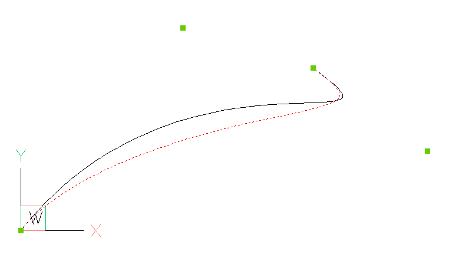

.. include:: ../spline-links.inc

.. _tut_spline:

Tutorial for Spline
===================

Background information about `B-spline`_ at Wikipedia.

Splines from fit points
-----------------------

Splines can be defined by fit points only, this means the curve goes through all given fit points.
AutoCAD and BricsCAD generates required control points and knot values by itself, if only fit points
are present.

Create a simple spline:

.. code-block:: python

    doc = ezdxf.new('R2000')

    fit_points = [(0, 0, 0), (750, 500, 0), (1750, 500, 0), (2250, 1250, 0)]
    msp = doc.modelspace()
    spline = msp.add_spline(fit_points)

.. image:: gfx/spline1.png

Append a fit point to a spline:

.. code-block:: python

    # fit_points, control_points, knots and weights are list-like containers:
    spline.fit_points.append((2250, 2500, 0))

.. image:: gfx/spline2.png

You can set additional `control points`, but if they do not fit the auto-generated AutoCAD values, they will be ignored
and don't mess around with `knot`_ values.

Solve problems of incorrect values after editing a spline generated by AutoCAD:

.. code-block:: python

    doc = ezdxf.readfile("AutoCAD_generated.dxf")

    msp = doc.modelspace()
    spline = msp.query('SPLINE').first

    # fit_points, control_points, knots and weights are list-like objects:
    spline.fit_points.append((2250, 2500, 0))

As far as I have tested, this approach works without complaints from AutoCAD, but for the case of problems
remove invalid data:

.. code-block:: python

    # current control points do not match spline defined by fit points
    spline.control_points = []

    # count of knots is not correct:
    # count of knots = count of control points + degree + 1
    spline.knots = []

    # same for weights, count of weights == count of control points
    spline.weights = []

Splines by control points
-------------------------

To create splines from fit points is the easiest way to create splines, but this method is also the least accurate,
because a spline is defined by control points and knot values, which are generated for the case of a definition by
fit points, and the worst fact is that for every given set of fit points exist an infinite number of possible
splines as solution.

AutoCAD (and BricsCAD also) uses an proprietary algorithm to generate control points and knot values from fit points,
which differs from the well documented `Global Curve Interpolation`_. Therefore splines generated from fit points
by `ezdxf` do not match splines generated by AutoCAD (BricsCAD).

To ensure the same spline geometry for all CAD applications, the spline has to be defined by control points. The method
:meth:`~ezdxf.layouts.BaseLayout.add_spline_control_frame` adds a spline through fit points by calculating the control
points by the `Global Curve Interpolation`_ algorithm. There is also a low level function
:func:`ezdxf.math.global_bspline_interpolation` which calculates the control points from fit points.

.. code-block:: python

    msp.add_spline_control_frame(fit_points, method='uniform', dxfattribs={'color': 1})
    msp.add_spline_control_frame(fit_points, method='chord', dxfattribs={'color': 3})
    msp.add_spline_control_frame(fit_points, method='centripetal', dxfattribs={'color': 5})

- black curve: AutoCAD/BricsCAD spline generated from fit points
- red curve: spline curve interpolation, "uniform" method
- green curve: spline curve interpolation, "chord" method
- blue curve: spline curve interpolation, "centripetal" method

.. image:: gfx/spline3.png

Open Spline
~~~~~~~~~~~

Add and open (clamped) spline defined by control points with the method
:meth:`~ezdxf.layouts.BaseLayout.add_open_spline`. If no `knot`_ values are given, an open uniform knot vector will be
generated. A clamped B-spline starts at the first control point and ends at the last control point.

.. code-block:: python

    control_points = [(0, 0, 0), (1250, 1560, 0), (3130, 610, 0), (2250, 1250, 0)]
    msp.add_open_spline(control_points)

.. image:: gfx/spline4.png

Rational Spline
~~~~~~~~~~~~~~~

`Rational B-splines`_ have a weight for every control point, which can raise or lower the influence of the control point,
default weight = ``1``, to lower the influence set a weight < ``1`` to raise the influence set a weight > ``1``.
The count of weights has to be always equal to the count of control points.

Example to raise the influence of the first control point:

.. code-block:: python

    msp.add_closed_rational_spline(control_points, weights=[3, 1, 1, 1])

Spline properties
-----------------

Check if spline is a `closed curve`_ or close/open spline, for a closed spline the last point is connected to the
first point:

.. code-block:: python

    if spline.closed:
        # this spline is closed
        pass

    # close spline
    spline.closed = True

    # open spline
    spline.closed = False

Set start- and end tangent for splines defined by fit points:

.. code-block:: python

    spline.dxf.start_tangent = (0, 1, 0)  # in y-axis
    spline.dxf.end_tangent = (1, 0, 0)  # in x-axis

Get data count as stored in DXF file:

.. code-block:: python

    count = spline.dxf.n_fit_points
    count = spline.dxf.n_control_points
    count = spline.dxf.n_knots

Get data count of real existing data:

.. code-block:: python

    count = spline.fit_point_count
    count = spline.control_point_count
    count = spline.knot_count
