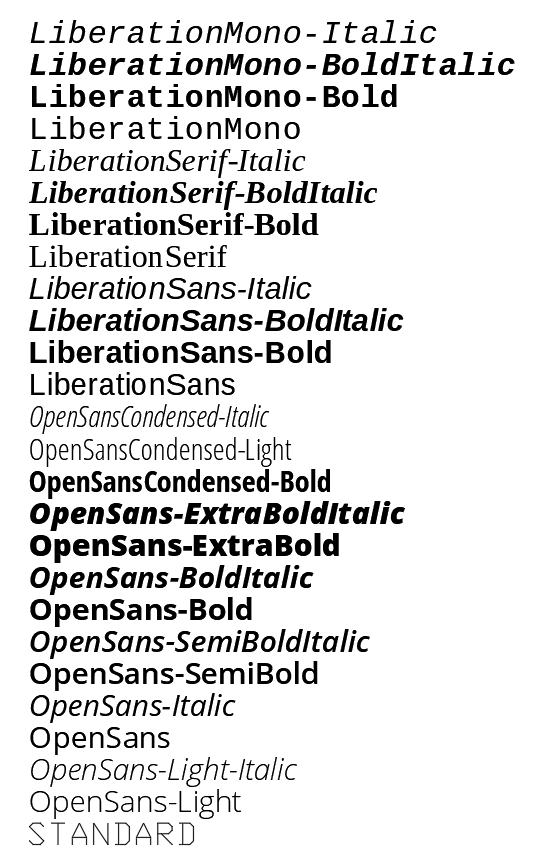

.. _tut_text:

Tutorial for Text
=================

TEXT - just one line
--------------------

Add simple one line text with the factory function :meth:`Layout.add_text`.

.. literalinclude:: ../../../examples/tut/text/simple_text.py

Valid text alignments for the *align* argument in :meth:`Text.set_pos`:

============   =============== ================= =====
Vert/Horiz     Left            Center            Right
============   =============== ================= =====
Top            ``TOP_LEFT``    ``TOP_CENTER``    ``TOP_RIGHT``
Middle         ``MIDDLE_LEFT`` ``MIDDLE_CENTER`` ``MIDDLE_RIGHT``
Bottom         ``BOTTOM_LEFT`` ``BOTTOM_CENTER`` ``BOTTOM_RIGHT``
Baseline       ``LEFT``        ``CENTER``         ``RIGHT``
============   =============== ================= =====

Special alignments are, ``ALIGNED`` and ``FIT``, they require a second alignment point, the text
is justified with the vertical alignment *Baseline* on the virtual line between these two points.

=========== ===========
Alignment   Description
=========== ===========
``ALIGNED`` Text is stretched or compressed to fit exactly between *p1* and *p2* and the text height is also adjusted to preserve height/width ratio.
``FIT``     Text is stretched or compressed to fit exactly between *p1* and *p2* but only the text width is
            adjusted, the text height is fixed by the *height* attribute.
``MIDDLE``  also a *special* adjustment, but the result is the same as for ``MIDDLE_CENTER``.
=========== ===========

Standard Text Styles
--------------------

Setup standard text styles and line types by argument :code:`setup=True`::

    doc = ezdxf.new('R12', setup=True)

Replaced all proprietary font declarations in :code:`setup_sytles()` (ARIAL, ARIAL_NARROW, ISOCPEUR and TIMES) by open
source fonts, this is also the style name (e.g. :code:`{'style': 'OpenSans-Italic'}`):

