.. module:: ezdxf.math
    :noindex:

.. _tut_ucs_transform:

Tutorial for UCS Based Transformations
======================================

With `ezdxf` v0.11 a new feature for entity transformation was introduced, which makes working with OCS/UCS much
easier, this is a new edition of the older :ref:`tut_ocs`. For the basic information read the old tutorial
please. In `ezdxf` v0.13 the :meth:`transform_to_wcs()` interface was replaced by the general transformation
interface: :meth:`transform()`.

For this tutorial we don't have to worry about the OCS and the extrusion vector, this is done automatically
by the :meth:`transform` method of each DXF entity.

Placing 2D Circle in 3D Space
-----------------------------

To recreate the situation of the old tutorial instantiate a new UCS and rotate it around the local x-axis.
Use UCS coordinates to place the 2D CIRCLE in 3D space, and transform the UCS coordinates to the WCS.

.. literalinclude:: src/ucs/circle.py
    :lines: 6-26

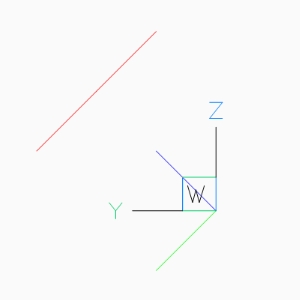
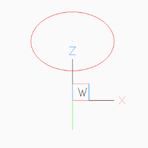

Placing LWPolyline in 3D Space
------------------------------

Simplified LWPOLYLINE example:

.. literalinclude:: src/ucs/lwpolyline.py
    :lines: 13-25

The 2D pentagon in 3D space in BricsCAD `Left` and `Front` view.

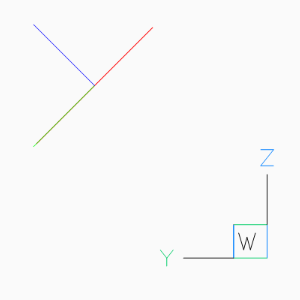
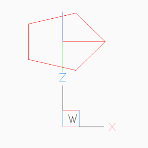

Using UCS to Place 3D Polyline
------------------------------

Simplified POLYLINE example: Using a first UCS to transform the POLYLINE and a second UCS to
place the POLYLINE in 3D space.

.. literalinclude:: src/ucs/polyline3d.py
    :lines: 13-37

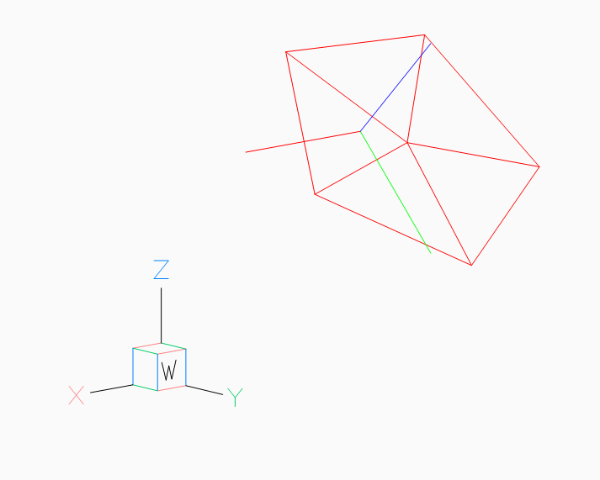

Placing 2D Text in 3D Space
---------------------------

The problem with the text rotation in the old tutorial disappears (or better it is hidden in :meth:`transform`)
with the new UCS based transformation method:

AutoCAD supports thickness for the TEXT entity only for `.shx` fonts and not for true type fonts.

.. literalinclude:: src/ucs/text.py
    :lines: 13-29

.. image:: gfx/ucs-text-top-bricscad.png
    :alt: text in ucs as top view

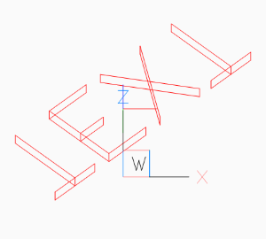

Placing 2D Arc in 3D Space
--------------------------

Same as for the text example, OCS angle transformation can be ignored:

.. literalinclude:: src/ucs/arc.py
    :lines: 13-37

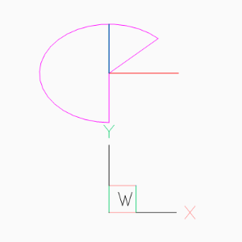
.. image:: gfx/ucs-arc-front.png
    :alt: arc in ucs as front view

Placing Block References in 3D Space
------------------------------------

Despite the fact that block references (INSERT) can contain true 3D entities like
LINE or MESH, the INSERT entity uses the same placing principe as TEXT or ARC
shown in the previous chapters.

To rotate the block reference 15 degrees around the WCS x-axis, we place the block reference in the origin of the UCS,
and rotate the UCS 90 degrees around its local y-axis, to align the UCS z-axis with the WCS x-axis:

This is just an excerpt of the important parts, see the whole code of `insert.py`_ at github.

.. literalinclude:: src/ucs/insert.py
    :lines: 47-58

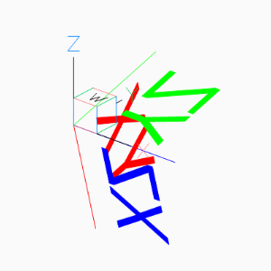
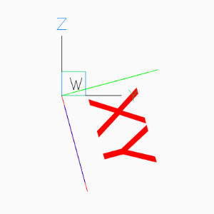

A more simple approach is to ignore the :attr:`rotate` attribute at all and just rotate the UCS.
To rotate a block reference around any axis rather than the block z-axis, rotate the
UCS into the desired position. Following example rotates the block reference around
the block x-axis by 15 degrees:

.. literalinclude:: src/ucs/insert.py
    :lines: 66-68

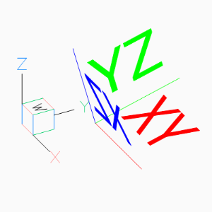
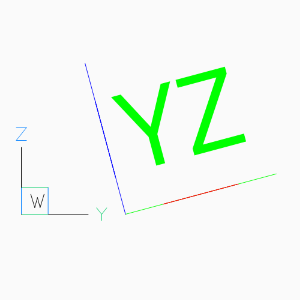

The next example shows how to translate a block references with an already established OCS:

.. literalinclude:: src/ucs/insert.py
    :lines: 72-76

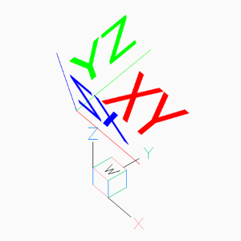
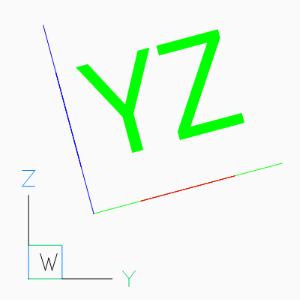

The next operation is to rotate a block reference with an established OCS, rotation axis is the block y-axis,
rotation angle is -90 degrees. The idea is to create an UCS in the origin of the already placed block reference,
UCS axis aligned to the block axis and resetting the block reference parameters for a new WCS transformation.

.. literalinclude:: src/ucs/insert.py
    :lines: 82-86

Reset block reference parameters, this places the block reference in the UCS origin and aligns the block axis
to the UCS axis, now we do a new transformation from UCS to WCS:

.. literalinclude:: src/ucs/insert.py
    :lines: 88-93

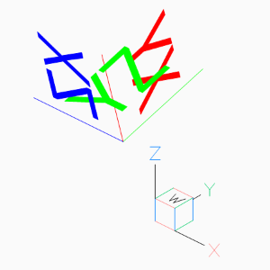
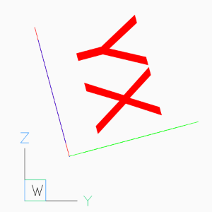

.. _insert.py: https://github.com/mozman/ezdxf/blob/master/docs/source/tutorials/src/ucs/insert.py
