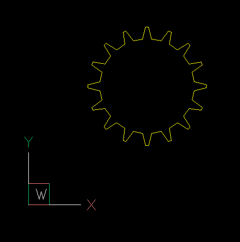
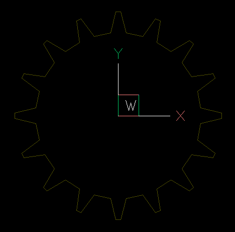
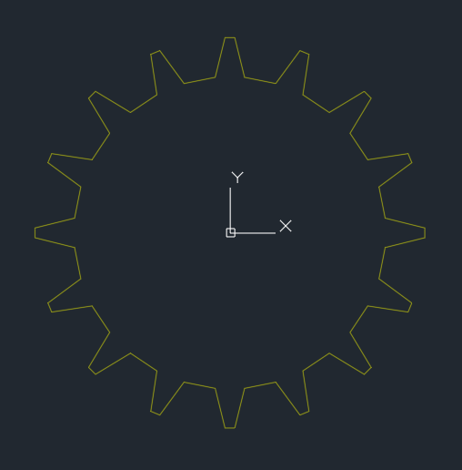

.. _tut_xref_module:

Tutorial for External References
================================

This tutorial uses the :mod:`ezdxf.xref` module to work with external references (XREF).

Attached XREFs are links to the modelspace of a specified drawing file. Changes made
to the referenced drawing are automatically reflected in the current drawing when it's
opened or if the XREF is reloaded.

.. important::

    **AutoCAD can only display DWG files as attached XREFs.**
    Any DXF file attached as an XREF to a DXF document must be converted to DWG in order
    to be viewed in AutoCAD.
    Fortunately, other CAD applications are more cooperative, BricsCAD has no problem
    displaying DXF files as XREFs.

    The :mod:`~ezdxf.addons.drawing` add-on included in `ezdxf` **does not display external
    references at all!**

There are some example files included in the `examples/xref <https://github.com/mozman/ezdxf/tree/master/examples/xref>`_
folder of the repository:

    - attach_dxf_dwg_xref.py
    - detach_block_as_xref.py
    - embed_dxf_dwg_xref.py
    - load_table_resources.py

Supported Entities
------------------

All operations which move entities between layouts and XREFs copy these entities,
therefore only entities which are copyable can be transferred.
The following entities are not copyable:

- All entities which are not documented by the DXF reference.
- ACAD_TABLE
- ACAD_PROXY_ENTITY
- OLE2FRAME
- ACIS based entities: BODY, 3DSOLID, REGION, ...
- Custom entities from applications on top of AutoCAD like Map 3D, Civil 3D or
  Architecture. The vertical integration stack is not documented by the DXF reference.

Unsupported entities are ignored and do not raise exceptions.

Environment Setup
-----------------

Required imports to follow this tutorial:

.. literalinclude:: src/xref/attach_dxf_dwg_xref.py
    :lines: 3-9

Function to create a simple DXF file as XREF, the insertion point of the XREF is set to
(5, 5):

.. literalinclude:: src/xref/attach_dxf_dwg_xref.py
    :lines: 14-26

Create the DXF file::

    make_dxf_xref_document("xref.dxf")

The XREF looks like this:

Attach a DXF File
-----------------

Create a host document to which the XREF will be attached::

    host_doc = ezdxf.new(DXFVERSION, units=units.M)

Attach the XREF by the :func:`ezdxf.xref.attach` function and save the host DXF file::

    xref.attach(host_doc, block_name="dxf_xref", insert=(0, 0), filename="attached_xref.dxf")
    host_doc.set_modelspace_vport(height=10, center=(0, 0))
    host_doc.saveas("attach_host_dxf.dxf")

The :func:`attach` function is meant to simply attach an XREF once without any
overhead, therefore the :func:`attach` function creates the required block definition
automatically and raises an :class:`XrefDefinitionError` exception if the block definition
already exist. To attach additional XREF references use the method
:meth:`~ezdxf.layouts.BaseLayout.add_blockref`::

    msp.add_blockref("dxf_xref", insert=another_location)

The attached DXF file in BricsCAD:

.. important::

    AutoCAD can not display DXF files as attached XREFs.

Attach a DWG File
-----------------

Export the DXF file as DWG by the :mod:`~ezdxf.addons.odafc` add-on::

    # It's not required to save the DXF file!
    doc = make_dxf_xref_document("attached_xref.dxf")
    try:
        odafc.export_dwg(doc, "attached_xref.dwg", replace=True)
    except odafc.ODAFCError as e:
        print(str(e))

Attach the DWG file by the :func:`ezdxf.xref.attach` function and save the host DXF file::

    host_doc = ezdxf.new(DXFVERSION, units=units.M)
    xref.attach(host_doc, block_name="dwg_xref", filename="attached_xref.dwg", insert=(0, 0))
    host_doc.set_modelspace_vport(height=10, center=(0, 0))
    host_doc.saveas("attached_dwg.dxf")

Attached DWG file in Autodesk DWG TrueView 2023:

Detach an XREF
--------------

The :func:`~ezdxf.xref.detach` function writes the content of a block definition into
the modelspace of a new DXF document and convert the block to an external reference (XREF).
The new DXF document has to be written/exported by the caller.
The function does not create any block references. These references should already exist
and do not need to be changed since references to blocks and XREFs are the same.

.. literalinclude:: src/xref/detach_dxf_dwg_xref.py
    :lines: 23-29

.. important::

    Save the host document after detaching the block!
    Detaching a block definition modifies the host document.

The :func:`detach` function returns a :class:`Drawing` instance, so it's possible
to convert the DXF document to DWG by the :mod:`~ezdxf.addons.odafc` add-on if necessary
(e.g. for Autodesk products). It's important that the argument :attr:`xref_filename`
match the filename of the exported DWG file:

.. literalinclude:: src/xref/detach_dxf_dwg_xref.py
    :lines: 33-42

It's recommended to clean up the entity database of the host document afterwards::

    host_doc.entitydb.purge()

For understanding, this is the :func:`make_block` function:

.. literalinclude:: src/xref/detach_dxf_dwg_xref.py
    :lines: 10-19

Embed an XREF
-------------

The :func:`embed` function loads the content of the XREF into the block definition,
this is the reverse operation of detaching an XREF.

For loading the content of DWG files is a loading function required, which loads the
DWG file as :class:`Drawing` document. The :mod:`~ezdxf.addons.odafc` add-on module
provides such a function: :func:`~ezdxf.addons.odafc.readfile`.

This example embeds the XREF "attached_xref.dwg" of the first example as content of the
block definition "GEAR", the "attach_host_dwg.dxf" file is the host DXF document:

.. code-block:: Python

    import ezdxf
    from ezdxf.addons import odafc

    doc = ezdxf.readfile("attach_host_dwg.dxf")
    gear_xref = doc.blocks.get("GEAR")

    try:
        xref.embed(gear_xref, load_fn=odafc.readfile)
    except FileNotFoundError as e:
        print(str(e))

The default loading function for DXF files is the :func:`ezdxf.readfile` function and
doesn't have to be specified. For the loading function from the :mod:`~ezdxf.recover`
module use a lambda function:

.. code-block:: Python

    import ezdxf
    from ezdxf import recover

    doc = ezdxf.readfile("attach_host_dxf.dxf")
    gear_xref = doc.blocks.get("GEAR")

    try:
        xref.embed(gear_xref, load_fn=lambda f: recover.readfile(f)[0])
    except FileNotFoundError as e:
        print(str(e))

Load Modelspace
---------------

The :func:`ezdxf.xref.load_modelspace` function loads the content of the modelspace
of the source document into a layout of the target document, the modelspace of the
target document is the default target layout.

.. hint::

    Use this function to combine multiple existing DXF files.
    If the goal is just to add new entities to an existing document, rather load the
    source document as a template by :func:`ezdxf.readfile`, add your content and save
    the document as a new DXF file with the :meth:`saveas` method.

Load Paperspace
---------------

The function :func:`ezdxf.xref.load_paperspace` loads a paperspace layout as a new
paperspace layout into the target document. To be clear this function loads **only**
the content of the paperspace layout, the content of the modelspace isn't loaded,
therefore the loaded VIEWPORT entities show the content of the target modelspace.

Write Block
-----------

The function :func:`ezdxf.xref.write_block` writes the given entities into the
modelspace of a new DXF document, this document can be, but doesn't have to be used as
an external referenced block.

Conflict Policies
-----------------

A resource conflict occurs when the source and target documents contain elements such as
layers, linetypes, text styles and so on that share the same name.

Many of the functions shown above support an argument to define the
:class:`ezdxf.xref.ConflictPolicy`, that gives you the choice how to handle resource
name conflicts.

ConflictPolicy.KEEP
~~~~~~~~~~~~~~~~~~~

Keeps the existing resource name of the target document and ignore the resource from the
source document. The loaded entities from the source document use the resources defined
in the target document and may alter their visual appearance, when the resources are
different.

ConflictPolicy.XREF_PREFIX
~~~~~~~~~~~~~~~~~~~~~~~~~~

This policy handles the resource import like CAD applications by **always** renaming the
loaded resources to `<xref>$0$<name>`, where `xref` is the name of source document,
the `$0$` part is a number to create a unique resource name and `<name>` is the name of
the resource itself.

.. important::

    This policy ALWAYS renames the resource, even if the loaded resource doesn't have a
    conflict in the target document.

ConflictPolicy.NUM_PREFIX
~~~~~~~~~~~~~~~~~~~~~~~~~~

This policy renames the loaded resources to `$0$<name>` only if the resource `<name>`
already exists. The `$0$` prefix is a number to create a unique resource name and
`<name>` is the name of the resource itself.

.. important::

    This policy renames the resource ONLY when the loaded resource has a conflict in
    the target document.

Load Table Resources
--------------------
