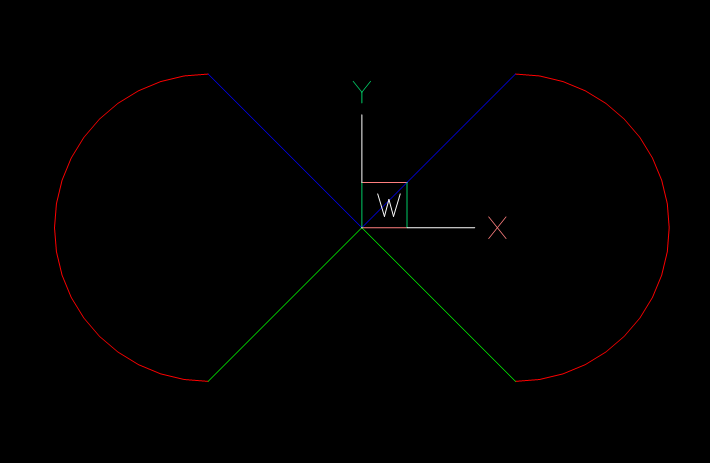
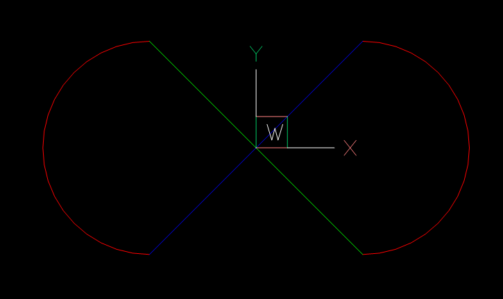

Upright
=======

.. versionadded:: 0.17

.. module:: ezdxf.upright

The functions in this module can help to convert an inverted :ref:`OCS` defined
by an extrusion vector (0, 0, -1) into a :ref:`WCS` aligned OCS defined by
an extrusion vector (0, 0, 1).

This simplifies 2D entity processing for `ezdxf` users and creates DXF
output for 3rd party DXF libraries which ignore the existence of the :ref:`OCS`.

Supported DXF entities:

- CIRCLE
- ARC
- ELLIPSE (WCS entity, flips only the extrusion vector)
- SOLID
- TRACE
- LWPOLYLINE
- POLYLINE (only 2D entities)
- HATCH
- MPOLYGON
- INSERT (block references)

.. warning::

    The WCS representation of OCS entities with flipped extrusion vector
    is not 100% identical to the source entity, curve orientation and vertex order
    may change, see `additional explanation`_ below.
    A mirrored text represented by an extrusion vector (0, 0, -1)
    cannot represented by an extrusion vector (0, 0, 1), therefore this CANNOT
    work for text entities or entities including text:
    TEXT, ATTRIB, ATTDEF, MTEXT, DIMENSION, LEADER, MLEADER

Usage
-----

The functions can be applied to any DXF entity without expecting errors or
exceptions if the DXF entity is not supported or the extrusion vector differs
from (0, 0, -1). This also means you can apply the functions multiple times to
the same entities without any problems. A common case would be to upright all
entities of the model space:

.. code-block:: Python

    import ezdxf
    from ezdxf.upright import upright_all

    doc = ezdxf.readfile("your.dxf")
    msp = doc.modelspace()
    upright_all(msp)
    # doing it again is no problem but also has no further effects
    upright_all(msp)

Another use case is exploding block references (INSERT) which may include
reflections (= scaling by negative factors) that can lead to inverted
extrusion vectors.

.. code-block:: Python

    for block_ref in msp.query("INSERT"):
        entities = block_ref.explode()  # -> EntityQuery object
        upright_all(entities)

Functions
---------

.. autofunction:: upright(entity: DXFGraphic) -> None

.. autofunction:: upright_all(entities: Iterable[DXFGraphic]) -> None

Additional Explanation
----------------------

This example shows why the entities with an inverted OCS, extrusion vector is
(0, 0, -1), are not exact the same as with an WCS aligned OCS, extrusion vector
is (0, 0, 1).

.. note::

    The ARC entity represents the curve **always** in counter-clockwise
    orientation around the extrusion vector.

.. code-block:: Python

    import ezdxf
    from ezdxf.upright import upright
    from ezdxf.math import Matrix44

    doc = ezdxf.new()
    msp = doc.modelspace()

    arc = msp.add_arc(
        (5, 0),
        radius=5,
        start_angle=-90,
        end_angle=90,
        dxfattribs={"color": ezdxf.const.RED},
    )
    # draw lines to the start- and end point of the ARC
    msp.add_line((0, 0), arc.start_point, dxfattribs={"color": ezdxf.const.GREEN})
    msp.add_line((0, 0), arc.end_point, dxfattribs={"color": ezdxf.const.BLUE})

    # copy arc
    mirrored_arc = arc.copy()
    msp.add_entity(mirrored_arc)

    # mirror copy
    mirrored_arc.transform(Matrix44.scale(-1, 1, 1))

    # This creates an inverted extrusion vector:
    assert mirrored_arc.dxf.extrusion.isclose((0, 0, -1))

    # draw lines to the start- and end point of the mirrored ARC
    msp.add_line((0, 0), mirrored_arc.start_point, dxfattribs={"color": ezdxf.const.GREEN})
    msp.add_line((0, 0), mirrored_arc.end_point, dxfattribs={"color": ezdxf.const.BLUE})

Result without applying the :func:`upright` function - true mirroring:

.. code-block:: Python

    ...

    # This creates an inverted extrusion vector:
    assert mirrored_arc.dxf.extrusion.isclose((0, 0, -1))

    start_point_inv = mirrored_arc.start_point
    end_point_inv = mirrored_arc.end_point

    upright(mirrored_arc)
    # OCS is aligned with WCS:
    assert mirrored_arc.dxf.extrusion.isclose((0, 0, 1))

    # start- and end points are swapped after applying upright()
    assert mirrored_arc.start_point.isclose(end_point_inv)
    assert mirrored_arc.end_point.isclose(start_point_inv)

    # draw lines to the start- and end point of the mirrored ARC
    msp.add_line((0, 0), mirrored_arc.start_point, dxfattribs={"color": ezdxf.const.GREEN})
    msp.add_line((0, 0), mirrored_arc.end_point, dxfattribs={"color": ezdxf.const.BLUE})

Result after applying the :func:`upright` function - false mirroring:

To avoid this issue the ARC entity would have to represent the curve in clockwise
orientation around the extrusion vector (0, 0, 1), which is not possible!

.. note::

    The shape of the mirrored arcs is the same for both extrusion vectors, but
    the start- and the end points are swapped (reversed vertex order)!
