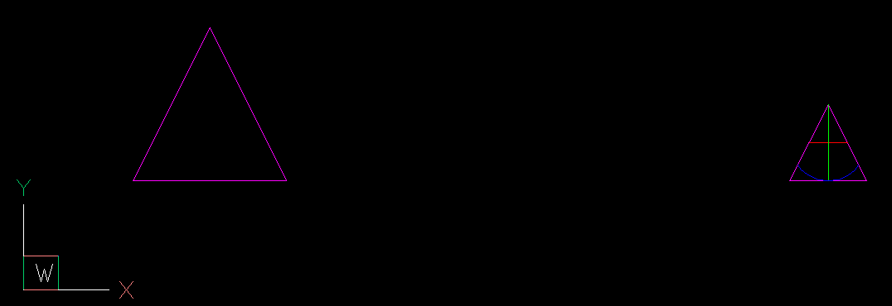

# Apply Clipping to a non-transformed INSERT
- How does the DXF attributes of [[SPATIAL_FILTER]] change when a transformation is applied to the parent [[INSERT]] entity?
- ## Base INSERT clipped
	- 
	- The block origin is (0, 0, 0) - the lower left corner of the triangle
	- ```
	  INSERT(#B9)
	    insert location: (5.0, 5.0, 0.0)
	    rotation: 0
	    scale-x: 1
	    scale-y: 1
	    scale-z: 1
	    SPATIAL_FILTER(#C1)
	    clipping-path: (Vec2(5.0, 5.0), Vec2(12.0, 5.0), Vec2(8.5, 12.0))
	  ```
	- the clipping path is located at the translated location
	- `inverse_insert_matrix` contains the translation (-5, -5, 0)
	- `transform_matrix` is the identity matrix
- ## Translation
	- 
	- Base INSERT copied to (15, 5, 0)
	- ```
	  INSERT(#C7)
	    insert location: (15.0, 5.0, 0.0)
	    rotation: 0
	    scale-x: 1
	    scale-y: 1
	    scale-z: 1
	    SPATIAL_FILTER(#CA)
	    clipping-path: (Vec2(5.0, 5.0), Vec2(12.0, 5.0), Vec2(8.5, 12.0))
	  ```
	- The clipping path vertices remain at the original location of the Base INSERT
	- `origin` is (0, 0, 0)
	- `inverse_insert_matrix` contains the translation (-5, -5, 0)
	- `transform_matrix` is the identity matrix
	-
	-
- ## Translation + Rotation
	- 
	- Base INSERT copied to (27.21..., 3.71...) rotated about 30 degrees
	- ```
	  INSERT(#CB)
	    insert location: (27.218911086754, 3.718911086754, 0.0)
	    rotation: 30.0
	    scale-x: 1
	    scale-y: 1
	    scale-z: 1
	    SPATIAL_FILTER(#CE)
	    clipping-path: (Vec2(5.0, 5.0), Vec2(12.0, 5.0), Vec2(8.5, 12.0))
	  ```
	- The clipping path vertices remain at the original location of the Base INSERT
	- `origin` is (0, 0, 0)
	- `inverse_insert_matrix` contains the translation (-5, -5, 0)
	- `transform_matrix` is the identity matrix
- ## Translation + Uniform Scaling
- 
- Base INSERT copied to (27.21..., 3.71...), uniform scaling by 0.5 applied
- ```
  INSERT(#CF)
    insert location: (35.0, 5.0, 0.0)
    rotation: 0
    scale-x: 0.5
    scale-y: 0.5
    scale-z: 0.5
    SPATIAL_FILTER(#D2)
    clipping-path: (Vec2(5.0, 5.0), Vec2(12.0, 5.0), Vec2(8.5, 12.0))
    ```
- The clipping path vertices remain at the original location of the Base INSERT
- `origin` is (0, 0, 0)
- `inverse_insert_matrix` contains the translation (-5, -5, 0)
- `transform_matrix` is the identity matrix
-
- ## Translation + Non-Uniform Scaling + Reflection (Mirror)
- 
- same, same, same as above
- # Apply Clipping to a transformed INSERT
- Same Base INSERT as before but with an applied scaling of (0.5, 1, 1) and the clipping path was applied to the transformed INSERT
- ```
  INSERT(#B9)
    insert location: (5.0, 5.0, 0.0)
    rotation: 0
    scale-x: 0.5
    scale-y: 1
    scale-z: 1
    SPATIAL_FILTER(#C6)
    clipping-path: (Vec2(5.0, 5.0), Vec2(8.5, 5.0), Vec2(6.75, 12.0))
  ```
- 
- The clipping path is the geometry entered via the [[XCLIP]] command in OCS coordinates  (=WCS in this case).
	- this is true for all four cases
- `origin` is (0, 0, 0)
	- this is true for all four cases
- `inverse_insert_matrix` contains the sacling and translation to transform the clipping path to block coordinates
	- this is true for all four cases
- `transform_matrix` is the identity matrix
	- this is true for all four cases
- ## BaseBlock with origin offset
- The block definition has an offset of (5, 5, 0)
- 
- ```
  INSERT(#36)
    insert location: (5.0, 5.0, 0.0)
    rotation: 0
    scale-x: 1
    scale-y: 1
    scale-z: 1
    SPATIAL_FILTER(#97)
    clipping-path: (Vec2(5.0, 5.0), Vec2(10.0, 5.0), Vec2(7.5, 10.0))
  ```
- The clipping path is the geometry entered via the [[XCLIP]] command in OCS coordinates  (=WCS in this case).
- `origin` is (0, 0, 0)
- `inverse_insert_matrix` id the identity matrix becasue the origin of the block is (5, 5), so the block coordiante system is aligned with the WCS
- `transform_matrix` is the identity matrix