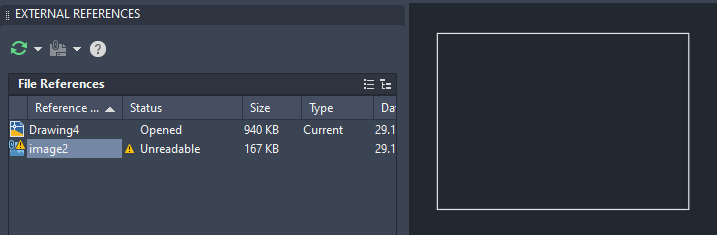

- BricsCAD stores the path to the image as full-path or relative-path if so set in the "Attach Raster Image" dialog.
- DWG TrueView (AutoCAD) (picky|bad as always!)
	- DWG TrueView **does not display** the image when the path is relative and the Image is not located in the same folder.
		- example: `..\Inbox\image1.jpg`
		- 
		- Reloading the Image solves the issue - see next point.
		-
	- DWG TrueView **does not display** the image when the path is relative and the Image is located in the same folder.
		- example: `.\image1.jpg`
		- Reloading the Image solves the issue:
		- 
		- 
		-
		-
	- DWG TrueView **does display** the image automatically when the path is absolute.
		- example: `C:\Users\mozman\Desktop\Inbox\image1.jpg`