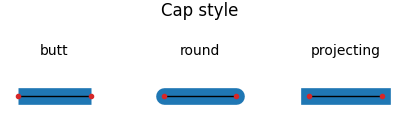

tags:: DXF-Internals

- The line cap- and join styles are not stored in the DXF entities itself!
- [[BricsCAD]] does not support the ENDCAPS and JOINSTYLE settings and always uses round caps and round join style.
- [[CTB]] files define line cap- and join styles:
	- END_STYLE_BUTT = 0
	- END_STYLE_SQUARE = 1
	- END_STYLE_ROUND = 2
	- END_STYLE_DIAMOND = 3 ???
	- END_STYLE_OBJECT = 4
	- JOIN_STYLE_MITER = 0
	- JOIN_STYLE_BEVEL = 1
	- JOIN_STYLE_ROUND = 2
	- JOIN_STYLE_DIAMOND = 3 ???
	- JOIN_STYLE_OBJECT = 5
- [[HEADER]] Section
	- HEADER Var [[$ENDCAPS]]
		- Lineweight endcaps setting for **new** objects:
			- 0 = None (butt)
			- 1 = Round
			- 2 = Angle ???
			- 3 = Square
	- HEADER Var [[$JOINSTYLE]]
		- Lineweight joint setting for **new** objects:
			- 0 = None
			- 1 = Round
			- 2 = Angle (bevel or miter?)
			- 3 = Flat (bevel or miter?)
			-
- ## [[Matplotlib]]
	- <https://matplotlib.org/stable/api/_as_gen/matplotlib.lines.Line2D.html>
	- [CapStyle enum](https://matplotlib.org/stable/api/_enums_api.html#matplotlib._enums.CapStyle)
		- 
	- [JoinStyle enum](https://matplotlib.org/stable/api/_enums_api.html#matplotlib._enums.JoinStyle)
		- {:height 408, :width 500}
		-
- ## [[PySide]] and [[PyQt]]
	- [Qt.PenCapStyle](https://doc-snapshots.qt.io/qt6-dev/qt.html#PenCapStyle-enum)
		- `Qt.FlatCap (butt)`
		- `Qt.SquareCap`
		- `Qt.RoundCap`
	- [Ot.PenJoinStyle](https://doc-snapshots.qt.io/qt6-dev/qt.html#PenJoinStyle-enum)
		- `Qt.MiterJoin`
			- The outer edges of the lines are extended to meet at an angle, 
			  and this area is filled.
		- `Qt.BevelJoin`
			- The triangular notch between the two lines is filled.
		- `Qt.RoundJoin`
			- A circular arc between the two lines is filled.
		- `Qt.SvgMiterJoin`
			- A miter join corresponding to the definition of a miter join in the SVG 1.2 Tiny specification.
	-
- ## [[SVG]]
	- [StrokeLinecapProperty](https://www.w3.org/TR/SVG2/painting.html#StrokeLinecapProperty)
		- `butt`
		- `round`
		- `square`
	- [StrokeLinejoinProperty](https://www.w3.org/TR/SVG2/painting.html#StrokeLinejoinProperty)
		- `miter`
		- `miter-clip`
		- `round`
		- `bevel`
		- `arcs`