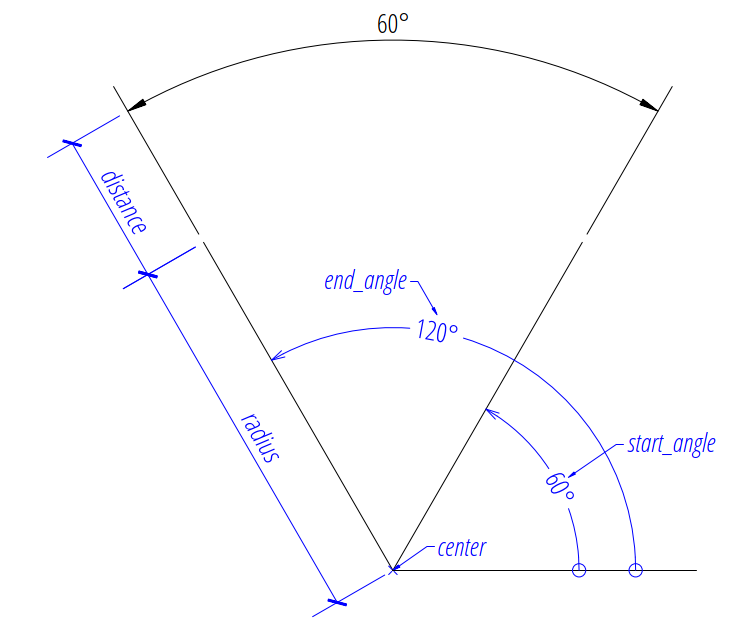
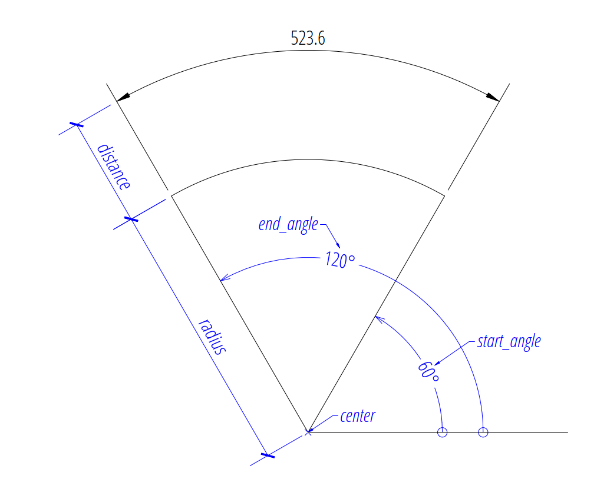
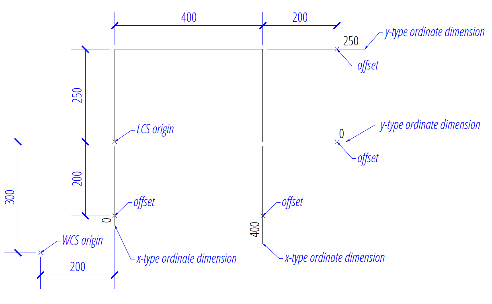
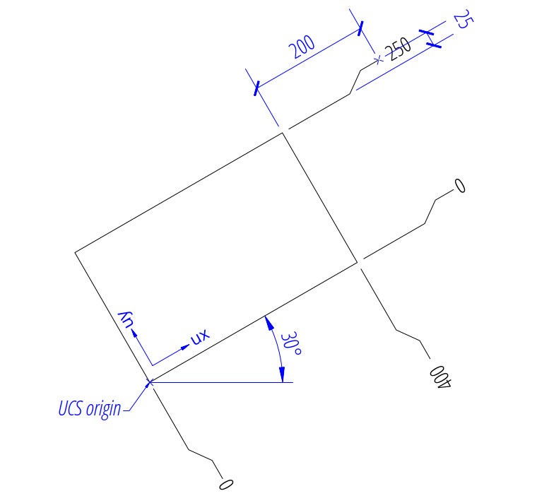
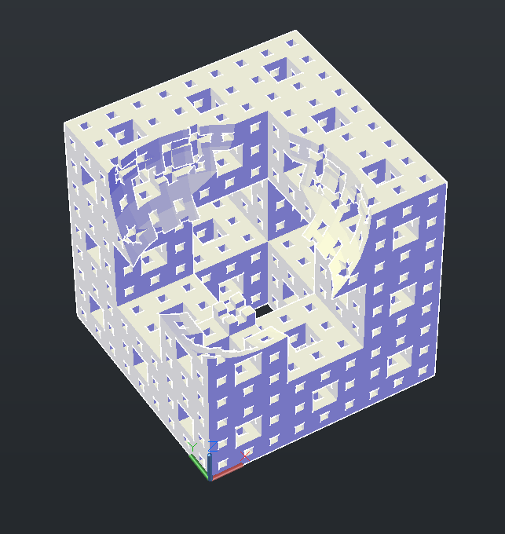
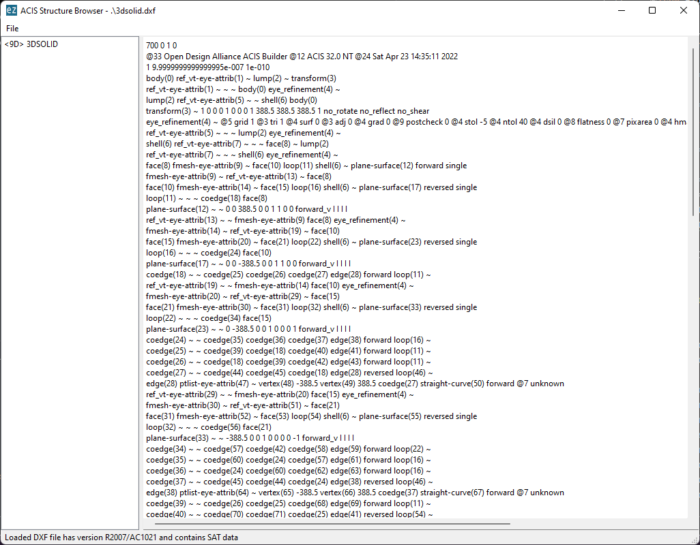

# Release v0.18.0
	- Changelog: ((654fc008-f879-48f1-a332-8f89b77d304a))
	-
- ## Dimension Types
	- ### Angular Dimension
		- New support for creating angular dimensions.
		- 
		- There are several factory methods to add angular dimensions
			- [layout.add_angular_dim_cra()](https://ezdxf.mozman.at/docs/layouts/layouts.html#ezdxf.layouts.BaseLayout.add_angular_dim_cra) - definition by **c**enter, **r**adius and **a**ngles
			- [layout.add_angular_dim_2l()](https://ezdxf.mozman.at/docs/layouts/layouts.html#ezdxf.layouts.BaseLayout.add_angular_dim_2l) - definition by two lines
			- [layout.add_angular_dim_3p()](https://ezdxf.mozman.at/docs/layouts/layouts.html#ezdxf.layouts.BaseLayout.add_angular_dim_3p) - definition by three points
			- [layout.add_angular_dim_arc()](https://ezdxf.mozman.at/docs/layouts/layouts.html#ezdxf.layouts.BaseLayout.add_angular_dim_arc) - definition by a `ConstructionArc` object
		- For more information: [Tutorial for Angular Dimension](https://ezdxf.mozman.at/docs/tutorials/angular_dimension.html)
		-
	- ### Arc Dimension
		- New support for creating arc dimensions.
		- 
		- There are several factory methods to add arc dimensions
			- [layout.add_arc_dim_cra()](https://ezdxf.mozman.at/docs/layouts/layouts.html#ezdxf.layouts.BaseLayout.add_arc_dim_cra) - definition by **c**enter, **r**adius and **a**ngles
			- [layout.add_arc_dim_3p()](https://ezdxf.mozman.at/docs/layouts/layouts.html#ezdxf.layouts.BaseLayout.add_arc_dim_3p) - definition by three points
			- [layout.add_arc_dim_arc()](https://ezdxf.mozman.at/docs/layouts/layouts.html#ezdxf.layouts.BaseLayout.add_arc_dim_arc) - definition by a `ConstructionArc` object
		- For more information: [Tutorial for Arc Dimension](https://ezdxf.mozman.at/docs/tutorials/arc_dimension.html)
		-
	- ### Ordinate Dimension
		- New support for creating ordinate dimensions by these factory methods:
			- [layout.add_ordinate_x_dim()](https://ezdxf.mozman.at/docs/layouts/layouts.html#ezdxf.layouts.BaseLayout.add_ordinate_x_dim) - add x-type ordinate dimension
			- [layout.add_ordinate_y_dim()](https://ezdxf.mozman.at/docs/layouts/layouts.html#ezdxf.layouts.BaseLayout.add_ordinate_y_dim) - add y-type ordinate dimension
		- Global feature location: the ordinate origin is the global WCS origin
		- 
		- Local feature location: the ordinate origin is the origin of a user defined `UCS`
		- 
		- For more information: [Tutorial for Ordinate Dimension](https://ezdxf.mozman.at/docs/tutorials/ordinate_dimension.html)
		-
- ## Extended Entity Query
	- Extended usability of the [EntityQuery](https://ezdxf.mozman.at/docs/query.html#entityquery-class) class.
	- This is a simple entity query which selects all `LINE` entities from the modelspace as starting point for the following explanations:
	  ```Python
	  lines = msp.query("LINE")
	  ```
	- Extended `__getitem__()` method to accept also a DXF attribute name that returns all entities which support this attribute, this is the base for supporting queries by relational operators.
	- New `__setitem__()` method to assigns a DXF attribute to all supported entities in the `EntityQuery` container. E.g. change the layer of all selected lines: `lines["layer"] = "MyLayer"`
	- New `__delitem__()` method to discard a DXF attribute from all entities in the `EntityQuery` container. E.g. delete the layer attribute from all selected lines: `del lines["layer"]`, which reset the layer to the default value `0`
	- New descriptors for some basic DXF attributes which simplifies the attributeselection and has auto-completion support from IDEs. E.g. change the layer of all selected lines: `lines.layer = "MyLayer"`
	- New selection by relational operators (`<, <=, ==, !=, >=, >`) which work in conjunction with the extended attribute selection of `__getitem__()` to allow further conditional selections. E.g. select all lines on layer    "MyLayer": `lines_on_my_layer = lines.layer == "MyLayer"`
	- New selection by regular expression: `lines.layer.match("^My.*")`
	- Use your own filter functions to build selections: `lines.filter(lambda e: ...)`
	- `Set` operators to combine queries by union (`|`), intersection (`&`), difference (`-`) and symmetric_difference (`^`).
	- Example for selecting all blue lines and red circles from modelspace:
	  ```Python
	  result = (msp.query("LINE").color == 5) | (msp.query("CIRCLE").color == 1)  
	  ```
	- For more information: [Extended EntityQuery Features](https://ezdxf.mozman.at/docs/query.html#extended-entityquery-features)
	-
- ## DXF Entity Improvements
	- ### DXF Attribute Helper Class
		- The [ezdxf.gfxattribs](https://ezdxf.mozman.at/docs/tools/gfxattribs.html) module provides the `GfxAttribs` class to create valid attribute dictionaries for the most often used DXF attributes supported by all graphical DXF entities. The advantage of using this class is auto-completion support by IDEs and an instant validation of the attribute values.
		  
		  ```Python
		  import ezdxf
		  from ezdxf.gfxattribs import GfxAttribs
		  
		  doc = ezdxf.new()
		  msp = doc.modelspace()
		  
		  attribs = GfxAttribs(layer="MyLayer", color=ezdxf.colors.RED)
		  line = msp.add_line((0, 0), (1, 0), dxfattribs=attribs)
		  circle = msp.add_circle((0, 0), radius=1.0, dxfattribs=attribs)
		  ```
		- For more information: [Documentation of the gfxattribs module](https://ezdxf.mozman.at/docs/tools/gfxattribs.html)
	- ### TEXT, ATTRIB and ATTDEF
		- [TextEntityAlignment](https://ezdxf.mozman.at/docs/enums.html#ezdxf.enums.TextEntityAlignment) enum replaces the string based alignment definition.
		- New `Text` methods:
			- [Text.get_placement()](https://ezdxf.mozman.at/docs/dxfentities/text.html#ezdxf.entities.Text.get_placement) replaces the deprecated method `Text.get_pos()`
			- [Text.set_placement()](https://ezdxf.mozman.at/docs/dxfentities/text.html#ezdxf.entities.Text.set_placement) replaces the deprecated method `Text.set_pos()`
			- [Text.get_align_enum()](https://ezdxf.mozman.at/docs/dxfentities/text.html#ezdxf.entities.Text.get_align_enum) replaces the deprecated method `Text.get_align()`
			- [Text.set_align_enum()](https://ezdxf.mozman.at/docs/dxfentities/text.html#ezdxf.entities.Text.get_align_enum) replaces the deprecated method `Text.set_align()`
	- ### Extended Factory Methods
		- [add_text()](https://ezdxf.mozman.at/docs/layouts/layouts.html#ezdxf.layouts.BaseLayout.add_text) additional keyword arguments `height` and `rotation`, `dxfattribs` is now a keyword argument
		- [add_attdef()](https://ezdxf.mozman.at/docs/layouts/layouts.html#ezdxf.layouts.BaseLayout.add_attdef): additional keyword arguments `height` and `rotation`, `dxfattribs` is now a keyword argument
	- ### MTEXT
		- New virtual DXF attribute `MText.dxf.text` which is linked to the `MText.text` attribute, this adds API compatibility to other text based entities: `TEXT`, `ATTRIB` and  `ATTDEF`
	- ### MULTILEADER
		- New support for creating [MULTILEADER](https://help.autodesk.com/view/OARX/2018/ENU/?guid=GUID-72D20B8C-0F5E-4993-BEB7-0FCF94F32BE0) entities.
		- New factory methods
			- [add_multileader_mtext()](https://ezdxf.mozman.at/docs/layouts/layouts.html#ezdxf.layouts.BaseLayout.add_multileader_mtext)
			- [add_multileader_block()](https://ezdxf.mozman.at/docs/layouts/layouts.html#ezdxf.layouts.BaseLayout.add_multileader_block)
		- Both factory methods return builder objects:
		- Base class [MultiLeaderBuilder](https://ezdxf.mozman.at/docs/render/mleader.html#ezdxf.render.MultiLeaderBuilder)
		- MText specialization: [MultiLeaderMTextBuilder](https://ezdxf.mozman.at/docs/render/mleader.html#ezdxf.render.MultiLeaderMTextBuilder)
		- Block specialization: [MultiLeaderBlockBuilder](https://ezdxf.mozman.at/docs/render/mleader.html#ezdxf.render.MultiLeaderBlockBuilder)
		- Due of the lack of good documentation it’s not possible to support all combinations of `MULTILEADER` properties with decent quality!
		- For more information: [Tutorial for creating MultiLeaders](https://ezdxf.mozman.at/docs/tutorials/mleader.html)
	- ### HELIX
		- New support for creating [HELIX](https://help.autodesk.com/view/OARX/2018/ENU/?guid=GUID-76DB3ABF-3C8C-47D1-8AFB-72942D9AE1FF) entities by the factory method [add_helix()](https://ezdxf.mozman.at/docs/layouts/layouts.html#ezdxf.layouts.BaseLayout.add_helix).
	- ### VIEWPORT/LAYER
		- New support for layer attribute override in `VIEWPORT` entities. This feature is implemented in the `LAYER` entity. The new method [Layer.get_vp_overrides](https://ezdxf.mozman.at/docs/tables/layer_table_entry.html#ezdxf.entities.Layer.get_vp_overrides) returns a [LayoutOverride](https://ezdxf.mozman.at/docs/tables/layer_table_entry.html#layeroverrides) object which allows overriding properties for this specific layer for individual viewports.
		- For more information: [Example](https://github.com/mozman/ezdxf/blob/master/examples/viewports_override_layer_attributes.py) for overriding layer attributes in viewports
		-
- ## CAD Application Settings
	- The [ezdxf.appsettings](https://ezdxf.mozman.at/docs/appsettings.html) is a high-level module for working with CAD application settings and behaviors. None of these settings have any influence on the behavior of `ezdxf`, since `ezdxf` only takes care of the content of the DXF file and not of the way it is presented to the user.
	- Example for updating the extents of the modelspace:
	  
	  ```Python
	  import ezdxf
	  from ezdxf import zoom, appsettings
	  
	  doc = ezdxf.readfile("your.dxf")
	  extents = appsettings.update_extents(doc)
	  ```
	  
	  The function updates only the values in the HEADER section, to zoom the active 
	  viewport to these extents, use the zoom module:
	  
	  ```Python
	  zoom.center(doc.modelspace(), extents.center, extents.size)
	  ```
	- For more information: [Documentation of the appsettings module](https://ezdxf.mozman.at/docs/appsettings.html)
	-
- ## Improved Bounding Box Module
	- Refactoring of the [ezdxf.bbox.extents](https://ezdxf.mozman.at/docs/bbox.html#ezdxf.bbox.extents) function to make use of the improved bounding box calculation for Bézier curves, this eliminates the need to estimate a suitable flattening distance. The argument `flatten` is replaced by `fast`.  If argument `fast` is ``True`` the calculation of Bézier curves is based on their control points, this may return a slightly larger bounding box. The `fast` mode also uses a simpler and mostly inaccurate text size calculation instead of the more precise but very slow calculation by `matplotlib`.
	-
- ## Add-ons
	- ### New Mesh Exchange Add-on
		- The [ezdxf.addons.meshex](https://ezdxf.mozman.at/docs/addons/meshex.html) module provides functions to exchange meshes with other tools by the following file formats:
			- `STL` - import/export
			- `OFF` - import/export
			- `OBJ` - import/export
			- `PLY` - export only
			- `OpenSCAD` - export as `polyhedron()`
			- `IFC4` - export only
		- The source or target object is always a `MeshBuilder` instance and therefore the supported features are also limited by this class. Only vertices and faces are exchanged, colors, textures and explicit face- and vertex normals are lost.
		- For more information: [Documentation of the meshex add-on](https://ezdxf.mozman.at/docs/addons/meshex.html)
	- ### New OpenScad Add-on
		- Interface to the [OpenSCAD](https://openscad.org/) application to apply boolean operations to `MeshBuilder` objects. The OpenSCAD application is **not** bundled with `ezdxf`, you need to install the application yourself.
		- This example subtracts a sphere from a Menger sponge by OpenSCAD and exports the result as `MESH` entity in a DXF file:
		  
		  ```Python
		  import ezdxf
		  from ezdxf.render import forms
		  from ezdxf.addons import MengerSponge, openscad
		  
		  doc = ezdxf.new()
		  msp = doc.modelspace()
		  
		  sponge = MengerSponge(level=3).mesh()
		  sponge.flip_normals()  # important for OpenSCAD
		  sphere = forms.sphere(
		  count=32, stacks=16, radius=0.5, quads=True
		  ).translate(0.25, 0.25, 1)
		  sphere.flip_normals()  # important for OpenSCAD
		  
		  script = openscad.boolean_operation(openscad.DIFFERENCE, sponge, sphere)
		  result = openscad.run(script)
		  result.render_mesh(msp)
		  
		  doc.set_modelspace_vport(6, center=(5, 0))
		  doc.saveas("OpenSCAD.dxf")
		  ```
		- 
		- For more information: [Documentation of the OpenSCAD add-on](https://ezdxf.mozman.at/docs/addons/openscad.html)
	- ### New Binpacking Add-on
		- This add-on is based on the 3D bin packing module [py3dbp](https://github.com/enzoruiz/3dbinpacking) to solve the [bin packing problem](https://en.wikipedia.org/wiki/Bin_packing_problem).
		- For more information: [Documentation of the binpacking add-on](https://ezdxf.mozman.at/docs/addons/binpacking.html)
	- ### Extended ODAFC Add-on
		- New functions added:
			- [ezdxf.addons.odafc.is_installed()](https://ezdxf.mozman.at/docs/addons/odafc.html#ezdxf.addons.odafc.is_installed)
			- [ezdxf.addons.odafc.convert()](https://ezdxf.mozman.at/docs/addons/odafc.html#ezdxf.addons.odafc.convert)
		- For more information: [Documentation of the odafc add-on](https://ezdxf.mozman.at/docs/addons/odafc.html)
		-
- ## Text Tools
	- New [ezdxf.tools.text.is_upside_down_text_angle()](https://ezdxf.mozman.at/docs/tools/text.html#ezdxf.tools.text.is_upside_down_text_angle) function
		- Returns `True` if the given text angle in degrees causes an upside down text in the WCS.
	- New [ezdxf.tools.text.upright_text_angle()](https://ezdxf.mozman.at/docs/tools/text.html#ezdxf.tools.text.upright_text_angle) function
		- Returns a readable (upright) text angle.
		-
- ## Path Improvements
	- ### Fillet and Chamfer Tools
		- New [ezdxf.path.fillet()](https://ezdxf.mozman.at/docs/path.html#ezdxf.path.fillet) function
			- Returns a Path with circular fillets of given `radius` between straight line segments.
		- New [ezdxf.path.polygonal_fillet()](https://ezdxf.mozman.at/docs/path.html#ezdxf.path.polygonal_fillet) function
			- Returns a Path with polygonal fillets of given `radius` between straight line segments.
		- New [ezdxf.path.chamfer()](https://ezdxf.mozman.at/docs/path.html#ezdxf.path.chamfer) function
			- Returns a Path with chamfers of given `length` between straight line segments.
		- New [ezdxf.path.chamfer2()](https://ezdxf.mozman.at/docs/path.html#ezdxf.path.chamfer2) function
			- Returns a Path with chamfers at the given distances `a` and `b` from the segment points between straight line segments.
	- ### Helix Tool
		- New [ezdxf.path.helix()](https://ezdxf.mozman.at/docs/path.html#ezdxf.path.helix) function
			- Returns a [helix](https://en.wikipedia.org/wiki/Helix) as a `Path` object
	- ### Bounding Box Calculation
		- Improved [ezdxf.path.bbox()](https://ezdxf.mozman.at/docs/path.html#ezdxf.path.bbox) function
			- New algorithm to determine the exact bounding boxes of Bézier curves, eliminating the need to estimate a suitable flattening distance. Added argument `fast` which allows bounding box calculation based on Bézier curve control points, this may result in slightly larger bounding boxes in favor of increased execution speed. Removed the arguments `flatten` and `segments` without deprecation warnings (raises `TypeError`).
- ## Render Tools
	- ### New Functions
		- New [ezdxf.render.forms.helix()](https://ezdxf.mozman.at/docs/render/forms.html#ezdxf.render.forms.helix) function
			- Yields the vertices of a helix.
		- New [ezdxf.render.forms.torus()](https://ezdxf.mozman.at/docs/render/forms.html#ezdxf.render.forms.torus) function
			- Returns a torus as `MeshTransformer` object.
		- New [ezdxf.render.forms.extrude_twist_scale()](https://ezdxf.mozman.at/docs/render/forms.html#ezdxf.render.forms.extrude_twist_scale) function
			- Extrude, twist and scale a profile polygon along a path polyline.
		- New [ezdxf.render.forms.sweep()](https://ezdxf.mozman.at/docs/render/forms.html#ezdxf.render.forms.sweep) function
			- Returns the mesh from sweeping a profile along a 3D path, where the sweeping path defines the final location in the `WCS`.
		- New [ezdxf.render.forms.sweep_profile()](https://ezdxf.mozman.at/docs/render/forms.html#ezdxf.render.forms.sweep_profile) function
			- Returns the intermediate profiles of sweeping a profile along a 3D path where the sweeping path defines the final location in the `WCS`.
		- Extended [ezdxf.render.forms.extrude()](https://ezdxf.mozman.at/docs/render/forms.html#ezdxf.render.forms.extrude) function
			- added parameter `caps` to close hull with top- and bottom faces
	- ### New `MeshBuilder` Methods
		- [ezdxf.render.MeshBuilder.bbox()](https://ezdxf.mozman.at/docs/render/mesh.html#ezdxf.render.MeshBuilder.bbox)
			- Returns the BoundingBox of the mesh.
		- [ezdxf.render.MeshBuilder.diagnose()](https://ezdxf.mozman.at/docs/render/mesh.html#ezdxf.render.MeshBuilder.diagnose)
			- Returns the `MeshDiagnose` object for this mesh.
		- [ezdxf.render.MeshBuilder.get_face_vertices()](https://ezdxf.mozman.at/docs/render/mesh.html#ezdxf.render.MeshBuilder.get_face_vertices)
			- Returns the indexed face as sequence of `Vec3` objects.
		- [ezdxf.render.MeshBuilder.get_face_normal()](https://ezdxf.mozman.at/docs/render/mesh.html#ezdxf.render.MeshBuilder.get_face_normal)
			- Returns the normal vector of the indexed face as `Vec3` object.
		- [ezdxf.render.MeshBuilder.face_normals()](https://ezdxf.mozman.at/docs/render/mesh.html#ezdxf.render.MeshBuilder.face_normals)
			- Yields all face normals.
		- [ezdxf.render.MeshBuilder.flip_normals](https://ezdxf.mozman.at/docs/render/mesh.html#ezdxf.render.MeshBuilder.flip_normals)
			- Flips the face normals inplace.
		- [ezdxf.render.MeshBuilder.open_faces()](https://ezdxf.mozman.at/docs/render/mesh.html#ezdxf.render.MeshBuilder.open_faces)
			- Yields all faces as sequence of integers where the first vertex is not coincident with the last vertex.
		- [ezdxf.render.MeshBuilder.optimize_vertices()](https://ezdxf.mozman.at/docs/render/mesh.html#ezdxf.render.MeshBuilder.optimize_vertices)
			- Returns a new mesh with optimized vertices.
		- [ezdxf.render.MeshBuilder.subdivide_ngons()](https://ezdxf.mozman.at/docs/render/mesh.html#ezdxf.render.MeshBuilder.subdivide_ngons)
			- Yields all faces as sequence of `Vec3` instances, where all ngons which have more than `max_vertex_count` vertices gets subdivided.
		- [ezdxf.render.MeshBuilder.tessellation()](https://ezdxf.mozman.at/docs/render/mesh.html#ezdxf.render.MeshBuilder.tessellation)
			- Yields all faces as sequence of `Vec3` instances, each face has no more vertices than the given `max_vertex_count`.
		- [ezdxf.render.MeshBuilder.mesh_tessellation()](https://ezdxf.mozman.at/docs/render/mesh.html#ezdxf.render.MeshBuilder.mesh_tessellation)
			- Returns a new `MeshTransformer` instance, where each face has no more vertices than the given `max_vertex_count`.
		- [ezdxf.render.MeshBuilder.separate_meshes()](https://ezdxf.mozman.at/docs/render/mesh.html#ezdxf.render.MeshBuilder.separate_meshes)
			- Returns separated meshes as multiple `MeshTransformer` instances.
		- [ezdxf.render.MeshBuilder.normalize_faces()](https://ezdxf.mozman.at/docs/render/mesh.html#ezdxf.render.MeshBuilder.normalize_faces)
			- Removes duplicated vertex indices from faces and stores all faces as open faces.
		- [ezdxf.render.MeshBuilder.unify_face_normals()](https://ezdxf.mozman.at/docs/render/mesh.html#ezdxf.render.MeshBuilder.unify_face_normals)
			- Returns a new `MeshTransformer` object with unified face normal vectors of all faces.
		- [ezdxf.render.MeshBuilder.unify_face_normals_by_reference()](https://ezdxf.mozman.at/docs/render/mesh.html#ezdxf.render.MeshBuilder.unify_face_normals_by_reference)
			- Returns a new `MeshTransformer` object with unified face normal vectors of all faces.
	- ### New `MeshDiagnose` Tool
		- New helper class [ezdxf.render.MeshDiagnose](https://ezdxf.mozman.at/docs/render/mesh.html#ezdxf.render.MeshDiagnose) to analyze and detect errors of `MeshBuilder` objects.
	- ### New `FaceOrientationDetector` Tool
		- New Helper class [ezdxf.render.FaceOrientationDetector](https://ezdxf.mozman.at/docs/render/mesh.html#ezdxf.render.FaceOrientationDetector) for face orientation and face normal vector detection.
		-
- ## Math Tools
	- ### New ConstructionPolyline Tool
		- New class [ezdxf.math.ConstructionPolyline](https://ezdxf.mozman.at/docs/math/core.html#constructionpolyline) to measure, interpolate and divide anything that can be approximated or flattened into vertices.
	- ### New ApproxParamT Tool
		- New class [ezdxf.math.ApproxParamT](https://ezdxf.mozman.at/docs/math/core.html#approxparamt), an approximation tool for parametrized curves.
	- ### New Plane Methods
		- New [ezdxf.math.Plane.intersect_line()](https://ezdxf.mozman.at/docs/math/core.html#ezdxf.math.Plane.intersect_line) method: Returns the intersection point of a 3D line and this plane.
		- New [ezdxf.math.Plane.intersect_ray()](https://ezdxf.mozman.at/docs/math/core.html#ezdxf.math.Plane.intersect_ray) method: Returns the intersection point of a 3D ray and this plane.
	- ### New 2D/3D Construction Function
		- New [ezdxf.math.split_polygon_by_plane()](https://ezdxf.mozman.at/docs/math/core.html#ezdxf.math.split_polygon_by_plane) function
			- Split a convex polygon by the given plane if needed.
		- New [ezdxf.math.intersection_line_polygon_3d()](https://ezdxf.mozman.at/docs/math/core.html#ezdxf.math.intersection_line_polygon_3d) function
			- Returns the intersection point of the 3D line form start to end and the given polygon.
		- New [ezdxf.math.spherical_envelope()](https://ezdxf.mozman.at/docs/math/core.html#ezdxf.math.spherical_envelope) function
			- Returns the spherical envelope for the given points.
		- New [ezdxf.math.cubic_bezier_bbox()](https://ezdxf.mozman.at/docs/math/core.html#ezdxf.math.cubic_bezier_bbox) function
			- Returns the bounding box of a cubic Bézier curve.
		- New [ezdxf.math.quadratic_bezier_bbox()](https://ezdxf.mozman.at/docs/math/core.html#ezdxf.math.quadratic_bezier_bbox) function
			- Returns the bounding box of a quadratic Bézier curve.
	- ### Changes of BoundingBox Classes
		- Change [ezdxf.math.BoundingBox.is_empty()](https://ezdxf.mozman.at/docs/math/core.html#ezdxf.math.BoundingBox.is_empty) method
			- Returns `True` if the bounding box is empty or the bounding box has a 
			  size of 0 in any or all dimensions or is undefined.
		- New [ezdxf.math.BoundingBox.has_intersection()](https://ezdxf.mozman.at/docs/math/core.html#ezdxf.math.BoundingBox.has_intersection) method replaces deprecated method `intersect()`
		- New [ezdxf.math.BoundingBox.has_overlap()](https://ezdxf.mozman.at/docs/math/core.html#ezdxf.math.BoundingBox.has_overlap) replaces deprecated method `overlap()`
		- New [ezdxf.math.BoundingBox.intersection()](https://ezdxf.mozman.at/docs/math/core.html#ezdxf.math.BoundingBox.intersection) method
			- Returns the 3D/2D bounding box of the intersection space
	- ### New RTree Tool
		- class [ezdxf.math.rtree.RTree](https://ezdxf.mozman.at/docs/math/rtree.html#ezdxf.math.rtree.RTree)
		- Immutable spatial search tree loosely based on [R-Trees](https://en.wikipedia.org/wiki/R-tree).
	- ### New Clustering Functions
		- [ezdxf.math.clustering.dbscan()](https://ezdxf.mozman.at/docs/math/clustering.html#ezdxf.math.clustering.dbscan)
		- [ezdxf.math.clustering.k_means()](https://ezdxf.mozman.at/docs/math/clustering.html#ezdxf.math.clustering.k_means)
		-
- ## ACIS Tools
	- The new [ezdxf.acis](https://ezdxf.mozman.at/docs/tools/acis.html) sub-package provides some ACIS data management tools for curious and experienced users. These tools cannot replace the official ACIS SDK due to the complexity of the data structures and the absence of an ACIS kernel in `ezdxf`.
	-
- ## Launcher
	- The new `info` command show info and optional stats of DXF files.
	  ```shell
	  C:\> ezdxf info gear.dxf
	  Filename: ".\gear.dxf"
	  Format: ASCII
	  Release: R2013
	  DXF Version: AC1027
	  Codepage: ANSI_1252
	  Encoding: utf-8
	  Created by ezdxf: 0.18b6 @ 2022-07-06T14:21:18.530488+00:00
	  Written by ezdxf: 0.18b6 @ 2022-07-06T14:21:18.530488+00:00
	  ```
	- The new `browse-acis` command can show and export the SAT or SAB content of ACIS entities.
	  ```shell
	  C:\> ezdxf browse-acis 3dsolid.dxf
	  ```
	- 
	- For more information read the [launcher](https://ezdxf.mozman.at/docs/launcher.html) documentation.