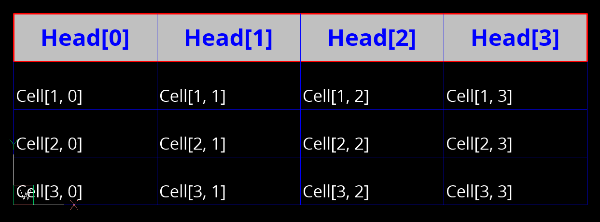

# Release v1.0.0
	- The project started in 2010 as the next generation of the [[dxfwrite]] package that added loading and editing features and implemented support for DXF versions newer than R12, and has now finally reached version 1.0 status.
	- A big thanks to [[Matt Broadway]] for contributing the [[drawing add-on]] which was the reason for adding a general transform interface and the path tools. These additions have greatly improved `ezdxf` as many tools are based on these basic features: the `explode`, `disassemble`, `bbox` and `zoom` modules, the `text2path` and `geo` add-ons, and many internal features. And the `drawing` add-on itself seems to be one of the most used features of the entire package - judging by the number of questions and bug reports associated with it 😉.
	- And thanks to all people who reported bugs, especially [Huang Yibin](https://github.com/chibai)!
	- Version 1.0.0 is basically version 0.18.1 with the deprecated functions and methods removed and a major revision of the documentation and type annotations.
	-
- ## Added Features
	- ## New [[Drawing]] Methods
		- The new method [`Drawing.paperspace()`](https://ezdxf.mozman.at/docs/drawing/drawing.html#ezdxf.document.Drawing.paperspace) returns paperspace layouts like the existing method `Drawing.layout()`, but has the correct return-type annotation [[Paperspace]] and can not return the [[Modelspace]].
		- The [`Drawing.page_setup()`](https://ezdxf.mozman.at/docs/drawing/drawing.html#ezdxf.document.Drawing.page_setup) method is a simple way to set up new print layouts or reset the properties of existing layouts. The paper size is specified by a format name as string like "ISO A0" or "Letter". If you need more control over the page set up process use the [`page_setup()`](https://ezdxf.mozman.at/docs/layouts/layouts.html#ezdxf.layouts.Paperspace.page_setup) 
		  method of the [`Paperspace`](https://ezdxf.mozman.at/docs/layouts/layouts.html#paperspace) class.
	- ## Paperspace Tutorial
		- The new [Tutorial for Viewports in Paperspace](https://ezdxf.mozman.at/docs/tutorials/psp_viewports.html#drawing-in-paperspace) shows how to define the paper size, add entities to the print layout, and add viewports to the paperspace.
	- ## ODA-FileConverter AppImage Support
		- The new `UNIX_EXEC_PATH` config option for the [[ODAFC]] add-on may help if the `which` command can not find the [[ODAFileConverter]] command and also adds support for AppImages provided by the [[Open Design Alliance]].
		- For more information read the updated [documentation](https://ezdxf.mozman.at/docs/addons/odafc.html#appimage-support).
		-
- ## Last Minute Changes
	- ### [[TablePainter]] Add-on
		- This is the formerly undocumented Table add-on which existed for an easy transition from [[dxfwrite]] to `ezdxf`. It's now an officially supported and [documented](https://ezdxf.mozman.at/docs/addons/tablepainter.html) add-on because full support for the [[ACAD_TABLE]] entity is very unlikely due to the enormous complexity for both the entity itself, and for the required infrastructure and also the lack of a usable documentation to implement all that features.
		- The add-on simply "paints" tables using DXF primitives, no automatically evaluated fields, no connection to databases or Excel files:
		- 
	- ### [[MTextSurrogate]] Add-on
		- This is the formerly undocumented `MText` add-on which existed only for an easy transition from [[dxfwrite]] to `ezdxf` and implements a [[MTEXT]] like feature for the DXF R12 format. It's now an officially supported and [documented](https://ezdxf.mozman.at/docs/addons/mtextsurrogate.html) add-on because it's used by the [[TablePainter]] add-on.
	- ### [[ASTM-D6673-10]] Exporter
		- This add-on creates special DXF files for use by Gerber Technology applications which have a low quality DXF parser and cannot parse/ignore BLOCKS which do not contain data according the ASTM-D6673-10 standard, see the [docs](https://ezdxf.mozman.at/docs/addons/gerber_D6673.html).
- ## Upcoming
	- There will be an extended period of only bug fixes without adding any major new features that will be released as a 1.0.x series to take a break from the project and these versions will not change any APIs, dependencies or minimum requirements.
	- For version 1.1, the minimum Python version will be raised to 3.8 or possibly 3.9 since even the latest LTS version of Ubuntu ships with Python 3.9. Or I sync the minimal Python version and provided binary wheels on PyPI with *matplotlib*, which is still releasing binary wheels for Python 3.8 at the end of 2022.
	- As for the new features, there are already many ideas in the `TODO.md` file, but I haven't decided yet which ones will be added and when, as this is still a hobby project, there is no set schedule for future releases: It's done when it's done.
	- It's also time to expand the [[DXF-Internals]] documentation to bring the knowledge baked into code into a more readable form.
	- Please post any comments, ideas or suggestions in the [discussion forum](https://github.com/mozman/ezdxf/discussions) on github.
- ### See you sometime, take care, stay healthy!
-
- # Release 1.0.1
	- Version v1.0.1 is a bugfix release, that also includes some minor new additions and an important change in the way how [[SPLINE]] entities are created from fit points only.
	- Up to this version, the control-points calculated by `ezdxf` for [[SPLINE]] entities from fit-points only did not match the control-points calculated by CAD applications.
	- After more than two years, [Antonio Spagnuolo](https://stackoverflow.com/users/11796986/antonio-spagnuolo) answered my [question](https://stackoverflow.com/questions/62472305/how-does-autocad-calculate-end-tangents-for-splines-defined-only-by-fit-points) about how to get the same control points as CAD applications on `stack overflow`. The solution does not require an end tangent estimate, so the tangent estimate arguments have been removed from the associated methods and functions.