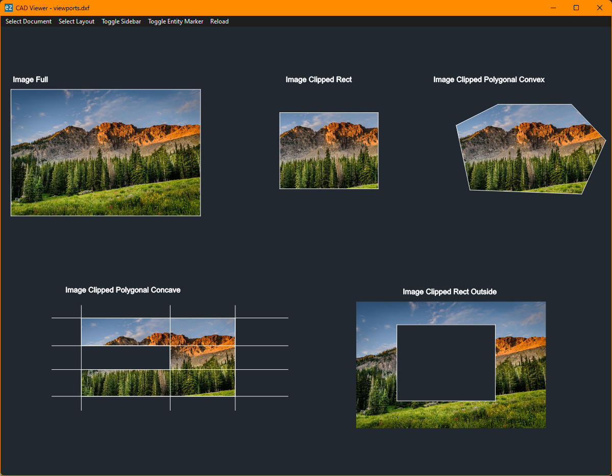
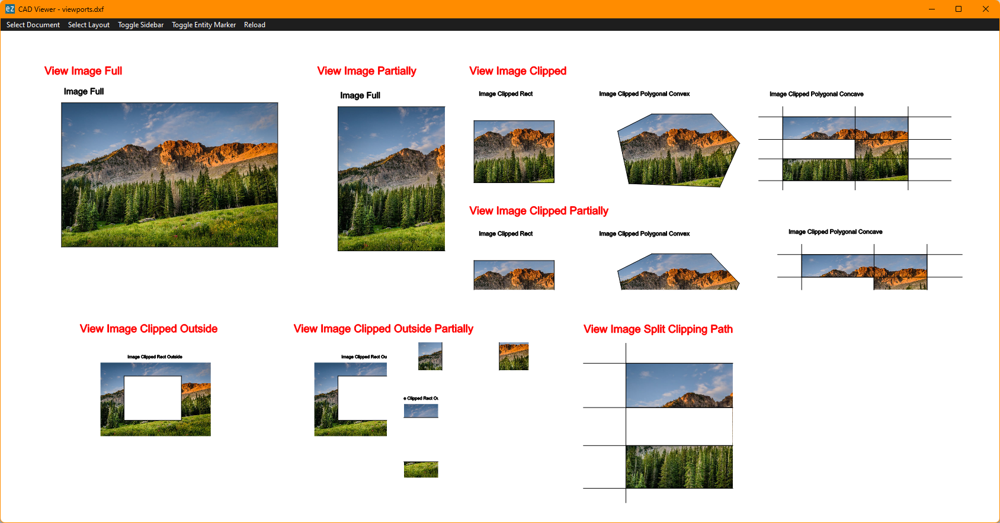
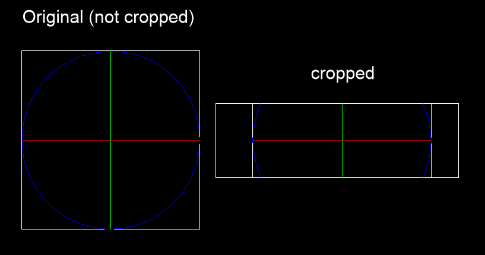

# Release v1.2.0
	- Changelog: ((6588217b-c1d3-44c1-a0d7-e5ee465cc6de))
	- This version of `ezdxf` requires at least Python 3.9
	- Continued integration of [[Numpy]] into the core library.
-
- ## IMAGE rendering support for the [[drawing add-on]]
	- Rendering support for the [[IMAGE]] entity was added by #mbway
	- The [[IMAGE]] rendering is supported for the modelspace:
		- 
	- and paperspace layouts:
		- 
	- This feature requires active support from the backend and is currently supported by these backends:
		- [[PyQtBackend]]
		- [[MatplotlibBackend]]
		- [[PyMuPdfBackend]]
- # Extended `draw` command
	- added by #mbway
	- The `ezdxf draw` command supports additional backends by the option `--backend {matplotlib,qt,mupdf,custom_svg}`
		- `matpoltlib`: [[MatplotlibBackend]]
		- `qt`: [[PyQtBackend]]
		- `mupdf`: [[PyMuPdfBackend]]
		- `custom_svg`: [[SVGBackend]]
	- The command `ezdxf draw --formats --backend <backend-name>` shows te supported output formats for the specified backend.
		-
- ## New Module `ezdxf.xclip`
	- The `ezdxf.xclip` module contains the the new `XClip` class. The `XClip` class can set or remove the clipping path of external references or block references like the [[XCLIP]] command in CAD applications.
	- The `XClip` class supports only 2D clippings path and cannot create inverted clipping paths.
	- 
	- For more information read the [docs](https://ezdxf.mozman.at/docs/tools/xclip.html).
-
- ## Rendering Support for Clipped Block References
	- The clipping of block references is supported by the [[drawing add-on]]