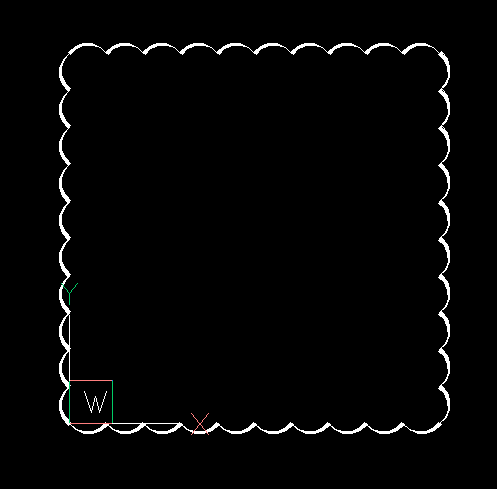

# Release v1.3.0
id:: 65ed4f87-230f-468a-a7d4-78e841752d87
	- Changelog: ((65e30c28-021e-4c24-ab6e-a9e9fa7c6a51))
	- Continued integration of [[Numpy]] into the core library.
	-
- ## New output backends for the [[drawing add-on]]
	- [[GeoJSONBackend]]
		- Creates a JSON-like output according the [[GeoJSON]] scheme.
		- All DXF entities are resolved into lines, polylines and polygons.
		- Curved shapes are flattened to polylines and polygons.
		- The properties are handled as a foreign member features.
	- [[CustomJSONBackend]]
		- Creates a JSON-like output with a custom JSON scheme.
		- All DXF entities are resolved into lines, polylines and polygons.
		- This scheme supports curved shapes by a SVG-path like structure and coordinates are not limited in any way.
		- This backend can be used to send geometries from a web-backend to a frontend.
		-
- ## Selection Tools
	- The [[ezdxf.select]] module provides entity selection capabilities, allowing users to select entities based on various shapes such as windows, points, circles, polygons, and fences.
	- The selection functions `bbox_inside()` and `bbox_outside()` work similarly to the inside and outside selection tools in CAD applications but the selection is based on the bounding box of the DXF entities rather than their actual geometry.
	- The `bbox_overlap()` function works similarly to crossing selection in CAD applications.
		- Entities that are outside the selection shape but whose bounding box overlapps the
		  selection shape are included in the selection.
		- This is not the case with crossing selection in CAD applications.
	- The selection functions accept any iterable of DXF entities as input and return an `EntityQuery` container, that provides further selection tools based on entity type and DXF attributes.
	- Tutorial for the `ezdxf.select` module: <https://ezdxf.mozman.at/docs/tutorials/entity_selection.html>
	-
- ## New `ezdxf.revcloud` module
	- The new [[ezdxf.revcloud]] module can render revision clouds similar to the `REVCLOUD` command in CAD applications.
		- 
		-
- ## New features for [[ACIS]] based entities
	- Support for copying of [[ACIS]] based entities
		- This adds support for loading these entities by the [[ezdxf.xref]] module
	- Support for transformation of [[ACIS]] based entities
		- The transformation is stored as temporary transformation and will be applied automatically before export.
		- The applied transformation is a transformed anonymous block that contains that [[ACIS]] entity.
- # Release v1.3.1
	- ((6634bed7-9a8c-4136-9a0c-96ce3078c948))
	- Bugfix release