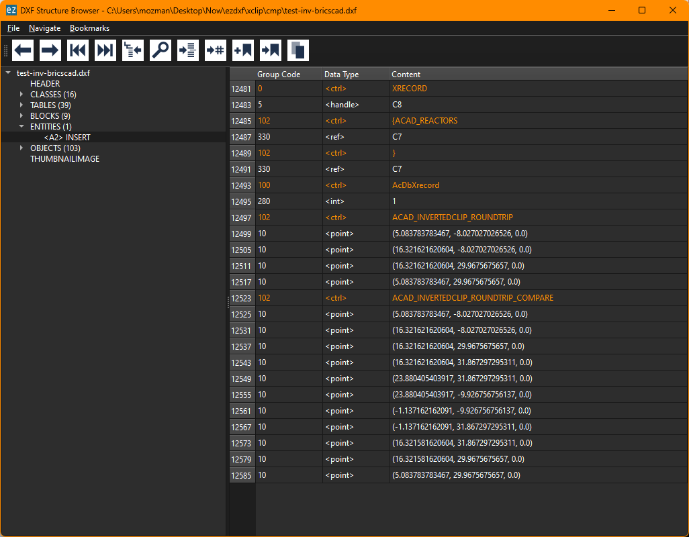

- [AutoCAD Help for XCLIP command](https://help.autodesk.com/view/ACD/2022/ENU/?guid=GUID-104EDB9F-F025-4F67-B5C9-B3F174CFE2F3)
- [How clip to XREFS and Blocks](https://www.autodesk.com/blogs/autocad/how-to-use-the-xclip-command-for-clipping-boundaries-with-xrefs-and-blocks-tuesday-tips-with-brandon/)
- The clipping path is attached to the [[INSERT]] entity via the [[Extension Dictionary]] and is stored in the [[SPATIAL_FILTER]] entity
- The boundary  polyline can be open but must consist of straight line segments and cannot intersect itself.
- The clipping can be inverted
- ## DXF Structure
	- The [[Extension Dictionary]] of the [[INSERT]] entity has an entry called `ACAD_FILTER` which references a [[DICTIONARY]] entity
	- The `ACAD_FILTER` dictionary has an entry `SPATIAL` which references a [[SPATIAL_FILTER]] entity, this entity stores the information about the clipping path
-
- ## Clipping Path Visibility
	- The visibility of the clipping path is stored in the [[SPATIAL_FILTER]] entity
	- The system variable [XCLIPFRAME](https://help.autodesk.com/view/ACD/2024/ENU/?guid=GUID-DA921BBF-A545-4144-A63D-D866772C3759) determines when the clipping path is displayed:
		- 0: The frame is not visible and it is not plotted. The frame temporarily reappears during selection preview or object selection.
		- 1: The clipped xref frame is displayed and plotted
		- 2: The clipped xref frame is displayed but not plotted
	- Init value of `XCLIPFRAME` is 2.
-
- ## Inverted Clipping Path
	- The inverted clipping path is stored in a [[XRECORD]] entity linked to the [[SPATIAL_FILTER]] entity via  the [[Extension Dictionary]] by the key `ACAD_XREC_ROUNDTRIP`
	- The structure looks like this: 
	- The sub section `ACAD_INVERTEDCLIP_ROUNDTRIP` contains the previous original clipping path
	- The sub section `ACAD_INVERTEDCLIP_ROUNDTRIP_COMPARE` contains the inverted clipping path which also stored in the [[SPATIAL_FILTER]] entity as new clipping path
	- The inverted clipping path __must__ follow some rules otherwise [[AutoCAD]] doesn't open the DXF file with the error message "Xdata wasn't read -- Invalid or incomplete DXF input -- drawing discarded."
	- I don't understand these rules for creating inverted clipping paths yet.
		- ... but I am happy to know what the problem is
		- [[BricsCAD]] accepts the inverted clipping paths created by `ezdxf`
	-